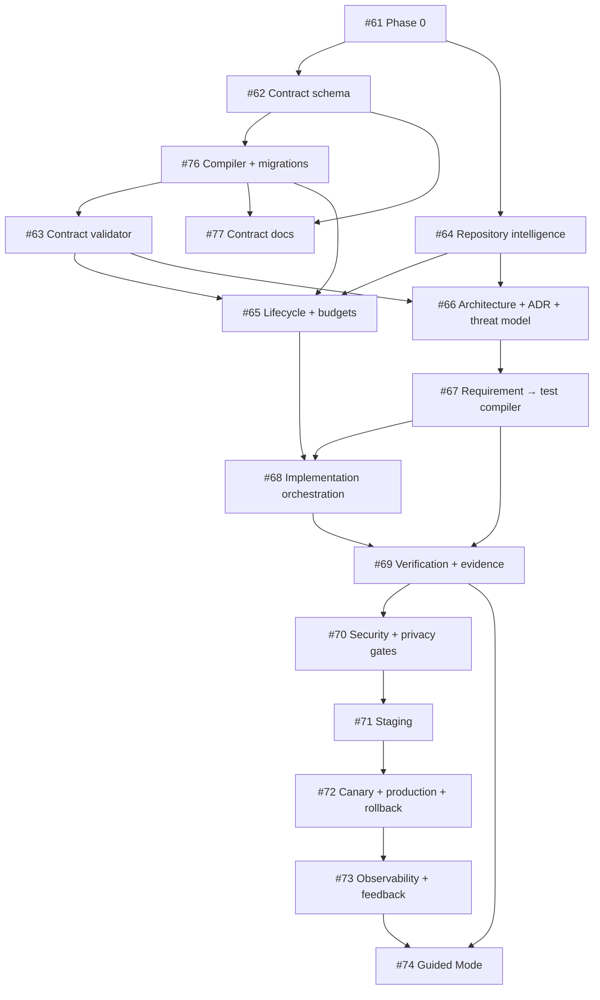

# PM Agent OS → Production Engineering OS End-to-End Plan

Status: Phase 0 planning baseline
Repository: `Abhillashjadhav/production-engineering-os`
Tracking issue: [#60](https://github.com/Abhillashjadhav/production-engineering-os/issues/60)
Phase 0 issue: [#61](https://github.com/Abhillashjadhav/production-engineering-os/issues/61)

## 1. Outcome and planning constraints

The target is an engineering control system that consumes an approved,
machine-readable PM Agent OS (PMOS) contract and produces a verified, deployable,
observable production outcome. Production Engineering OS (PEOS) may detect missing or
contradictory product information, but it must never invent business truth.

The plan is governed by these invariants:

1. Work does not begin without an issue.
2. One issue maps to one primary, atomic PR and dedicated branch.
3. Tests and deterministic acceptance predicates are compiled before implementation.
4. Evidence is bound to the exact candidate and deployment subjects.
5. Models may propose or review; deterministic systems decide gates.
6. Fixers do not approve their own changes, and written claims are not evidence.
7. Production promotion requires explicit, policy-authorized human approval.
8. A bounded repair loop stops on exhausted attempts, time, or cost.
9. No transition reaches `COMPLETED` from model output alone.
10. Phase 0 changes documentation and durable planning state only.

## 2. Target workflow

```mermaid
flowchart LR
  PM[Approved PMOS contract] --> CV[Compile and validate]
  CV --> RI[Repository intelligence]
  RI --> AR[Architecture, ADRs, threat model]
  AR --> TC[Requirements → tests]
  TC --> IP[Issue-first implementation plan]
  IP --> DPR[Issue + branch + atomic draft PR]
  DPR --> EX[Isolated specialist execution]
  EX --> DV[Deterministic verification]
  DV --> RV[Independent review]
  RV --> PR[Reviewed PR ready]
  PR --> MG[Approved and merged exact head]
  MG --> ST[Staging and integration]
  ST --> CA[Canary]
  CA --> PA{Production approval}
  PA --> PD[Progressive production deploy]
  PD --> LV[Live verification]
  LV --> EV[Sealed evidence and completion]
  EV --> FB[PMOS outcome feedback]

  CV -. product input .-> PM
  DV -. bounded repair .-> EX
  RV -. bounded repair .-> EX
  ST -. code/config defect: new remediation issue and run .-> RI
  ST -. infrastructure or cleanup blocker .-> BL[BLOCKED]
  CA -. rollback .-> RB[Rollback]
  LV -. rollback .-> RB
```

The authoritative state definitions, transition evidence, actors, failures, approvals,
and rollback behavior are in [TARGET-ARCHITECTURE.md](TARGET-ARCHITECTURE.md).

## 3. Delivery phases

### Phase 0 — Audit and governing plan

Issue: [#61](https://github.com/Abhillashjadhav/production-engineering-os/issues/61)

Deliver the evidence-backed capability audit, product decisions, metrics and gates,
target architecture, issue/PR governance, implementation issue graph, and durable loop
state. Publish them in one documentation-only draft PR. Do not merge or implement.

Acceptance criteria:

- every required capability has one supported classification;
- the PMOS/PEOS boundary and unresolved decisions are explicit;
- every lifecycle transition names evidence, authority, failure, approval, and next state;
- metrics use stable denominators and define pass/fail gates;
- atomic implementation issues exist in dependency order;
- documentation/schema/lint/repository checks are recorded against the exact PR head;
- credible review findings are resolved or rejected with written rationale;
- the PR remains draft and receives no self-approval.

### Phase 1 — Trustworthy intake and repository context

Issues:

1. [#62](https://github.com/Abhillashjadhav/production-engineering-os/issues/62) — canonical PMOS contract bundle schema
2. [#76](https://github.com/Abhillashjadhav/production-engineering-os/issues/76) — loss-aware compiler and migrations
3. [#63](https://github.com/Abhillashjadhav/production-engineering-os/issues/63) — completeness, contradiction, ownership, and approval validation
4. [#64](https://github.com/Abhillashjadhav/production-engineering-os/issues/64) — deterministic repository intelligence
5. [#77](https://github.com/Abhillashjadhav/production-engineering-os/issues/77) — contract authoring, validation, and migration documentation

The schema, compiler logic, and narrative authoring documentation are separate atomic
outcomes under the repository's concern-based rule. The compiled bundle is the
canonical product input. Validators emit machine-readable findings and stop for
missing product decisions. Repository intelligence is a deterministic, digest-bound
fact set, not an unrestricted agent assessment.

Exit criteria:

- versioned schemas and compiler migrations cover all required PMOS fields;
- invalid, ambiguous, contradictory, or unapproved contracts cannot advance;
- IDs and source digests are immutable and traceable;
- repository facts are repeatable, bounded, and proven against fixtures;
- #64 may proceed independently beside #62/#76; #76 depends on #62; #63 depends on
  #62/#76; documentation #77 depends on #62/#76 and may proceed beside #63/#64.

### Phase 2 — Architecture and test compilation

Issues:

1. [#66](https://github.com/Abhillashjadhav/production-engineering-os/issues/66) — architecture, ADR, and threat-model artifacts
2. [#67](https://github.com/Abhillashjadhav/production-engineering-os/issues/67) — requirement-to-test compiler and test-before-code enforcement

Architecture uses validated contract and repository facts. Test compilation turns
requirements, acceptance criteria, non-functional requirements, and risks into a
deterministic coverage manifest before code changes are authorized.

Exit criteria:

- architecture decisions name constraints, alternatives, boundaries, and reversals;
- threat models cover assets, actors, trust boundaries, mitigations, and verification;
- every in-scope requirement and acceptance criterion maps to an executable test or an
  explicit, approved manual evidence procedure;
- missing or invalid coverage blocks implementation;
- architecture-boundary rules are machine-checkable.

### Phase 3 — Unified control and execution

Issues:

1. [#65](https://github.com/Abhillashjadhav/production-engineering-os/issues/65) — unified lifecycle, bounded repair, and budgets
2. [#68](https://github.com/Abhillashjadhav/production-engineering-os/issues/68) — issue-first specialist implementation orchestration

Consolidate the divergent run models into one persisted lifecycle. Execute atomic units
in isolated worktrees with role, file, tool, test, time, token, and repair bounds.

Exit criteria:

- transitions are optimistic-lock-safe, append-only, resumable, and policy-gated;
- attempts, tokens, elapsed time, external compute, and spend are observable budgets;
- issue, branch, primary PR, scope, and dependency rules are enforced;
- a fixer cannot verify or approve its own candidate;
- scope drift and budget exhaustion fail closed;
- worktree disposal never deletes unproven user work.

### Phase 4 — Verification, independent review, and evidence

Issues:

1. [#69](https://github.com/Abhillashjadhav/production-engineering-os/issues/69) — exact-SHA evidence package and false-DONE prevention
2. [#70](https://github.com/Abhillashjadhav/production-engineering-os/issues/70) — security, privacy, dependency, secret, and boundary gates

Build a deterministic gate orchestrator and a signed or attestable EvidenceBundle. Keep
analysis, remediation, and approval separate. A changed candidate invalidates stale
proofs and reviews.

Exit criteria:

- required unit, integration, end-to-end, migration, performance, accessibility,
  architecture, security, privacy, dependency, and secret gates are policy-selected;
- every proof binds commit SHA, tree/artifact/config/migration/deployment digests, tool
  identity/version, environment, command or attestation, and result;
- false-DONE fixtures cannot transition to completion;
- policy exceptions are named, scoped, expiring, and auditable;
- independent review findings have severity, disposition, owner, and resolution proof.

### Phase 5 — Real delivery and rollback

Issues:

1. [#71](https://github.com/Abhillashjadhav/production-engineering-os/issues/71) — real staging and integration verification
2. [#72](https://github.com/Abhillashjadhav/production-engineering-os/issues/72) — canary, production promotion, live verification, and rollback

Introduce provider-neutral interfaces with one real, safely testable adapter path.
Promote the same immutable artifact through staging, canary, and production.

Exit criteria:

- deployments are real, idempotent, environment-protected, and digest-verified;
- staging verifies integrations, migrations, smoke tests, and cleanup;
- canary cohorts, windows, SLOs, abort thresholds, and rollback targets are explicit;
- #72 delivers the minimum deployment-correlated telemetry, SLO/business-guardrail
  evaluator, alert/abort path, and rollback trigger required before canary starts;
- production approval is named and bound to exact subjects;
- live failure automatically enters rollback, and rollback is regularly exercised;
- simulation is never accepted as production delivery evidence.

### Phase 6 — Operations and product feedback

Issues:

1. [#73](https://github.com/Abhillashjadhav/production-engineering-os/issues/73) — observability, SLO evaluation, incident evidence, and PMOS feedback
2. [#74](https://github.com/Abhillashjadhav/production-engineering-os/issues/74) — non-technical Guided Mode

Build on #72's release-critical instrumentation to correlate lifecycle, CI, deployment,
runtime, cost, and outcome telemetry across runs and repositories. Add durable
dashboards, incident evidence, and structured OutcomeReports to PMOS. Guided Mode
explains state and decisions without hiding evidence or weakening gates.

Exit criteria:

- dashboards and alerts cover lifecycle health, production SLOs, security/privacy
  guardrails, cost, false-DONE, rollback, and escaped defects;
- telemetry follows a documented redaction and retention policy;
- OutcomeReports bind measured product outcomes to contract and deployment versions;
- Guided Mode surfaces plain-language next actions, approvals, evidence, and risks;
- Guided Mode cannot bypass controls or manufacture product answers.

## 4. Dependency graph and recommended order

Recommended execution:

1. close Phase 0 only after formal review and merge by an authorized maintainer;
2. implement schema-only #62 first, then compiler/migration logic #76;
3. run #64 independently in parallel with #62/#76 when maintainers are available;
4. implement #63 after #62/#76; documentation-only #77 may run beside #63/#64;
5. implement #66, then #67;
6. complete #65 after #63/#64; it may overlap #66/#67 with interface coordination;
7. implement #68, #69, and #70 in order;
8. implement #71, #72, and #73 in order;
9. implement #74 after #73 provides the trustworthy observability and feedback
   interfaces its product-facing status and feedback flows consume.

The umbrella [#60](https://github.com/Abhillashjadhav/production-engineering-os/issues/60)
is the authoritative index. Each child issue remains independently reviewable and has
one primary PR.

## 5. Testing strategy

### Contract and control-plane tests

- JSON Schema and Pydantic compatibility and migration fixtures
- canonicalization, stable IDs, source-digest, and mutation tests
- contradiction, completeness, ownership, approval, and adversarial ambiguity suites
- state-transition property tests, optimistic-lock races, replay, crash recovery, and
  budget exhaustion tests
- policy fail-closed tests and authorization-boundary tests

### Repository and architecture tests

- golden repository fixtures for supported languages and layouts
- dirty-worktree, symlink, submodule, generated-file, and monorepo boundary cases
- deterministic architecture/ADR/threat-model normalization
- dependency graph and architecture-boundary checks

### Delivery tests

- requirement-to-test mutation and traceability tests
- unit, integration, end-to-end, migration, performance, and accessibility tests chosen
  from the contract and risk policy
- isolated specialist worktree, scope, tool, and credential tests
- staging integration, artifact parity, migration rollback, canary threshold, progressive
  promotion, live journey, and rollback drills

### Security, privacy, and evidence tests

- SAST, secret, dependency, provenance, artifact, infrastructure, and policy scans
- data inventory, minimization, purpose, retention, deletion, encryption, access, and
  log-redaction verification
- stale proof, forged result, wrong SHA, skipped check, changed config, incomplete
  evidence, and self-review false-DONE fixtures
- signature/attestation verification and EvidenceBundle schema compatibility

## 6. Release strategy

PEOS itself is released progressively:

1. shadow mode evaluates contracts and produces evidence without changing repositories;
2. advisory mode creates plans and draft artifacts with human execution;
3. bounded draft-PR mode implements within isolated scopes but cannot deploy;
4. staging mode deploys only to protected non-production environments;
5. bounded canary mode uses explicit cohort, window, guardrails, and rollback;
6. production mode requires named approval and immutable-artifact promotion.

Every autonomy increase requires observed guardrail compliance over a predeclared sample
and window. Roll back to the prior autonomy level when false-DONE, security/privacy,
escaped-defect, cost, or reliability guardrails breach.

## 7. Stopping conditions

The system stops and records a resumable state when any of these is true:

- required product truth is absent, contradictory, unapproved, or stale;
- acceptance criteria cannot be compiled into deterministic verification;
- repository facts are ambiguous or an unsafe working-tree conflict exists;
- a required issue, branch, PR, reviewer, environment, credential, or permission is absent;
- a gate fails and the finding is outside permitted repair scope;
- attempt, time, token, credit, external-compute, or spend budget is exhausted;
- a required proof is missing, stale, untrusted, or bound to the wrong subject;
- a security, privacy, data, SLO, canary, or live-production guardrail breaches;
- rollback cannot be proven safe;
- human approval is required but absent, rejected, stale, or expired.

Stopping is a valid safety outcome, not a delivery failure to be hidden. The durable state
must name the blocker, owner, evidence, safe state, and exact resume condition.

## 8. Human decisions before later phases

The audit cannot establish these business or organizational truths:

- authoritative PMOS publisher identity and approval roles;
- final metric targets, evaluation windows, and eligible denominator exclusions;
- autonomy ceiling and production approval policy;
- supported deployment providers and initial production environment;
- data classifications, residency, retention, deletion, and regulatory obligations;
- cost/credit budgets and whether Fast mode is permitted per stage;
- eligible independent/formal GitHub reviewers and required review count;
- signing, attestation, evidence-retention, and redaction policy;
- supported repository/language/platform matrix for the MVP.

These do not block the documentation-only Phase 0 PR. They do block the affected
implementation or production transition, and PEOS must request them rather than guess.

## 9. Phase 0 handoff

The first implementation issue is
[#62](https://github.com/Abhillashjadhav/production-engineering-os/issues/62).
Phase 1 must start from the merged Phase 0 planning baseline, revalidate its issue scope
against the then-current main branch, create a dedicated branch, and remain schema-only:
do not start compiler #76, documentation #77, validator, or orchestration work in
#62's PR.
