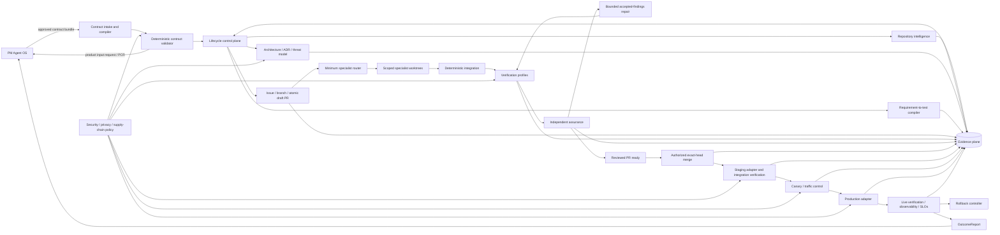
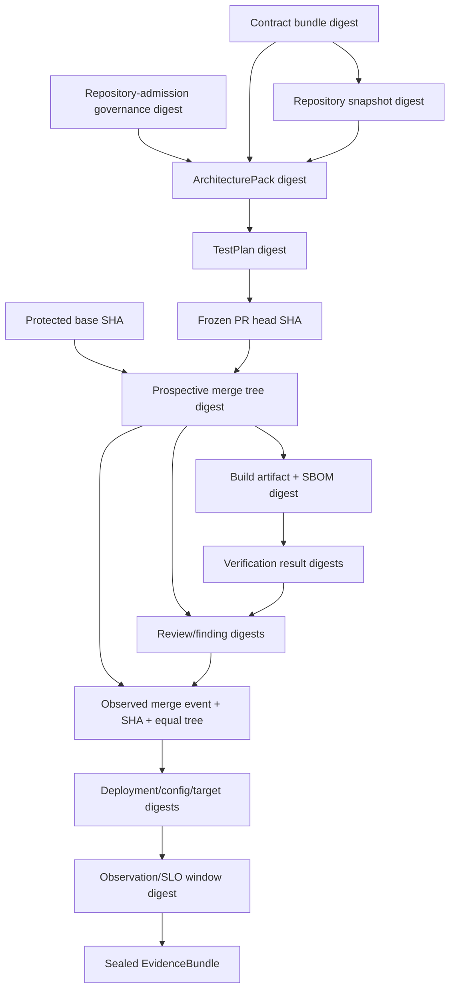

# Target architecture

## Architecture goals

Production Engineering OS (PEOS) consumes an approved PM Agent OS (PMOS) contract
bundle and produces a verified, deployable, observable product without inferring
missing business truth. The architecture separates:

- **control plane** — state, policy, permissions, budgets, approvals, stopping;
- **execution plane** — repository analysis, specialists, tests, build, deploy;
- **evidence plane** — content-addressed artifacts, test/review/deploy/observe proof;
- **security plane** — trust boundaries, least privilege, secrets, privacy, waivers.

Existing V1–V3 primitives are inputs to this target, not discarded systems.

## Component architecture

## Planes and component responsibilities

### Control plane

| Component | Responsibility | Existing foundation | Target addition |
|---|---|---|---|
| Contract intake | Load, version, digest, compile formats | `pmpe.contracts`, three schemas | Canonical bundle/manifest schema (#62) and loss-aware compiler (#76) |
| Contract policy | Completeness, contradiction, ownership, approvals | schema validators, V1 `RequirementValidator` | Versioned rule registry and PM-owned blockers (#63) |
| Lifecycle engine | Legal transitions, actor permissions, resume | V1/V2/V3 state machines | One transition policy, migration, budgets, bounded repair (#65) |
| Authorization | Human approvals and agent/task/file scope | policy engine, production approval, fixer gate | Exact action/artifact/config/target subjects and expiry |
| Budget controller | Tokens, credits, time, attempts, external compute | ledger `cost` field only | Per-stage/run budgets and `BUDGET_EXCEEDED` |
| GitHub governor | Issue/branch/PR atomicity and draft state | local Git adapter and PR records | Issue-first remote adapter with no direct merge authority plus protected-branch merge queue/compare-and-swap admission for the reviewed head/base/tree (#68/#69) |

The control plane is the only component that changes lifecycle state. Model output is
an untrusted proposal until a deterministic admission rule accepts it.

### Execution plane

| Component | Responsibility | Existing foundation | Target addition |
|---|---|---|---|
| Repository intelligence | Exact-SHA read-only normalized content snapshot plus separately versioned governance observation | arbitrary V2 assessment | deterministic scanners/adapters (#64) |
| Architecture compiler | Components, boundaries, ADRs, threats, deployment/observe/rollback design | V1 templates, V2 architect | admitted ArchitecturePack (#66) |
| Test compiler | Requirements/criteria/risks/guardrails to executable evidence nodes | V1 stack templates, executed traceability | generalized TestPlan and meaningful-red gate (#67) |
| Specialist router | Minimum capable roster | V2 router | five missing profiles and runtime worktree spawning (#68) |
| Worktree executor | Test/implementation tasks with scoped writes | `specialist_worktree` | lifecycle-managed worktrees and task/file permissions |
| Integration | Compose branches, run full checks, freeze candidate | V2 integration agent/freeze | exact commit/build/config subject binding |
| Verification runner | Pinned unit/integration/E2E/migration/perf/a11y/security/privacy/boundary profiles | quality gates and product CI | normalized profiles, reproducible toolchains (#69/#70) |
| Deployment adapters | Execute staging/canary/production and rollback | real local deploy, preview, simulated production | real protected-environment adapters (#71/#72) |
| Guided Mode | Progressive-disclosure product-owner interface | CLI/skills | parity UI over the same APIs (#74) |

### Evidence plane

The EvidenceBundle is a content-addressed manifest with two deliberately separate
layers:

1. A replay-stable semantic claim records the evidence type/schema, producer role,
   command/tool/model/rule-set versions, subject and input/output digests,
   and a policy-selected execution-environment fingerprint. The fingerprint includes
   applicable OS/distribution and architecture, language/runtime, executable/tool and
   dependency-resolution/lock digests, container or runner image digest, locale/timezone,
   relevant non-secret environment/configuration/policy digests, and hardware class for
   hardware-sensitive checks. Secret references are digested identifiers, never values.
   The claim also records its PASS/FAIL/BLOCKED/NOT_PROVEN result, any schema-defined
   canonical result digest, and versioned retention/redaction policy. Its canonical
   semantic digest excludes run-instance metadata and non-canonical raw logs.
2. An append-only event envelope records producer instance identity, run/attempt ID,
   runner/host identity, explicit UTC start/end timestamps, raw-artifact location and
   digest, and supersedes/duplicate relationships. The envelope has its own audit
   digest and references the semantic digest.

A bundle's replay-stable digest is calculated from the sorted semantic member digests
and stable subject/profile references. Audit envelopes are retained and integrity
checked but do not change semantic replay equality merely because the same work ran
later. Deterministic replay compares semantic, subject, input, and output digests;
run-instance timestamps are expected to differ. An environment-sensitive claim is
inapplicable—not equivalent—when its required environment fingerprint differs or is
missing.

Evidence completeness uses stage-specific profiles. Each checkpoint seals a new
content-addressed EvidenceBundle that references and supersedes the prior stage bundle:

| Profile | Required members added at this stage |
|---|---|
| Contract admission | contract source/version/digest, validation, approvals, and rule-set digest |
| Pre-code | exact-SHA repository snapshot; repository-admission governance observation ID/digest/timestamp/query provenance; architecture, ADRs, threat model, TestPlan, issue/branch/draft-PR record; post-creation governance checkpoint; and meaningful-red evidence |
| Candidate review | exact PR head, protected-base SHA, prospective merge-tree digest, fresh candidate governance checkpoint, build/SBOM/provenance, deterministic verification, independent reviews, and finding lifecycle |
| Merge admission | reviewed head/base/prospective tree, required checks/approvals, merge actor/time/method/SHA/tree equality, and primary issue linkage |
| Staging | immutable artifact/config/target, deployment, integration, migration, smoke, security, and teardown/rollback readiness |
| Canary | bounded cohort/traffic policy, deployment, complete SLO/guardrail window, abort decision, and rollback readiness |
| Production authorization | named approval bound to merge/artifact/config/migration/target/rollout subjects |
| Production deployment | progressive deployment, exact subject correlation, and rollback target |
| Rollback and incident | exact failed deployment/exposure and last-known-good subjects, pre-recorded rollback attempt/idempotency key, executed steps, restored traffic/config/service/data state, RTO/RPO result, post-rollback verification, and incident/decision evidence |
| Completion | live SLO/guardrail observation window, acceptance evidence, final rollback readiness, and OutcomeReport |

A gate requires 100% of the members in its current and preceding applicable profiles,
not artifacts from future stages. Thus an MVP draft PR can seal a complete candidate
review bundle without pretending that production evidence already exists.

Governance observations are checkpoint-scoped. Repository admission records the
baseline; issue/branch/draft-PR creation, candidate freeze, readiness, and merge
admission each append a fresh observation. A transition declares its expected
lifecycle-owned effects (for example, creating the admitted branch and draft PR). When
the observed delta exactly matches that effect manifest and the protected base,
repository content, toolchain, protection policy, and other dependencies are unchanged,
the new observation supersedes the prior governance member without invalidating
architecture or TestPlan evidence. An unexpected dirty/index/worktree change, target
base movement, protection/ruleset change, conflicting PR/branch, remote change, or
unexplained query gap invalidates the evidence nodes that depend on it and returns to
the appropriate re-admission gate.

Any other changed upstream digest invalidates dependent evidence. Contract approval,
publisher authorization, version, and supersession status are asynchronously monitored
and revalidated before every forward transition or external mutation. Revocation,
expiry, or supersession immediately forbids new implementation and rollout, and asks
GitHub to dequeue a not-yet-merged PR. GitHub cannot atomically compare external
authorization at its merge linearization point: if merge wins that race, the merge is
recorded as repository integration only, the no-rollout product-input transition runs,
and staging remains forbidden. A no-rollout state uses the explicit product-input transition below; active
staging is cleaned through `STAGING_FAILED`, and active/indeterminate canary or changed
production exposure is rolled back before `PRODUCT_INPUT_REQUIRED`. Emergency
monitoring, teardown, rollback, and incident actions remain authorized by their
separate safety policy. Corrections create a new manifest; sealed evidence is not
overwritten.

### Security boundaries

| Boundary | Trust rule |
|---|---|
| PMOS → intake | Contract content is untrusted until schema, digest, approvals, ownership, and semantic rules pass. No secret values are permitted. |
| Agent → control plane | Agent artifacts are untrusted proposals. Deterministic admission, task/file scope, and product-boundary rules apply. |
| Reviewer → candidate | Reviewer is read-only, sees the frozen exact candidate, and is separate from fixer/verifier. Formal GitHub approval is a distinct human event. |
| PEOS → GitHub | Least-privilege token; issue/branch/draft-PR only by stage. No force-push, self-approval, or merge authority. |
| PEOS → build/dependency network | Pinned/locked sources, egress allowlist, SCA/SBOM/provenance, no credential persistence. |
| PEOS → staging/production | Short-lived target-scoped identity, protected environment, exact-subject approval, network/data policy, audit log. |
| Product → telemetry | Data allowlist/minimization, tenant separation, retention/deletion, redaction, access control. |
| Evidence storage | Append-only/content-addressed after sealing; sensitive references instead of values; approved retention. |

## Deployment architecture

```mermaid
flowchart LR
    BUILD[Verified immutable artifact] --> STG[Isolated staging]
    STG -->|smoke + integration + migration + security| SGATE{Staging gate}
    SGATE -->|fail| SROLL[Teardown / staging rollback]
    SGATE -->|pass| CAPP{Canary authorization}
    CAPP --> CANARY[Bounded canary cohort]
    CANARY -->|SLO / guardrail breach| PROLL[Production rollback]
    CANARY -->|window passes| PAPP{Named production approval}
    PAPP --> PROD[Progressive production promotion]
    PROD --> LIVE[Live verification + observation window]
    LIVE -->|breach| PROLL
    LIVE -->|pass| COMPLETE[Evidence-backed COMPLETED]
```

The provider, protected environments, canary size/window, approvers, SLOs, RTO/RPO,
data rollback policy, and minimum observation window are human decisions. Until
provided, real deployment transitions are `BLOCKED`, not simulated successes.

## Observability architecture

All lifecycle and runtime events use correlation keys:

`contract_slice_id → run_id → issue → branch/worktree → commit/tree → build/SBOM →
PR → staging deployment → canary → production deployment → observation window →
OutcomeReport/PCR`.

Required telemetry classes:

- structured lifecycle and runtime logs with field allowlists;
- RED/USE or equivalent service metrics plus contract-approved business outcomes;
- distributed traces when an integration crosses process/service boundaries;
- SLO definitions and burn-rate/threshold evaluation;
- dashboards for delivery, release, SLO, security/privacy, cost, and autonomy;
- actionable alerts with owner, severity, deduplication, and runbook;
- rollback and incident events tied to the release;
- fleet aggregation for the metrics in `METRICS-AND-GATES.md`.

Vendor choice, data region, retention, and approved business signals are unresolved.

## PM Agent OS integration

### Inbound

PMOS sends:

1. bundle manifest and version;
2. product truth and traceable IDs;
3. approvals and approver roles;
4. outcome/leading/guardrail definitions and targets;
5. security/privacy/data intent;
6. release/observability/rollback intent.

PEOS returns `CONTRACT_INVALID` for structural/ownership violations and
`PRODUCT_INPUT_REQUIRED` for missing business truth. It never edits the approved
contract in place.

### Outbound

PEOS returns:

- validation diagnostics and ProductInputRequest;
- ArchitectureDecisionRequest for cross-boundary decisions;
- ProductChangeRequest for engineering-discovered product changes;
- release/incident/rollback evidence;
- OutcomeReport comparing hypothesis, outcome, metrics, guardrails, and SLO evidence;
- recommended options and engineering consequences, never an automatic product
  decision.

## Lifecycle state machine

### State invariants

- State and transition policy are versioned and stored outside chat.
- Every transition names its actor and exact evidence subjects.
- Unsupported infrastructure produces `BLOCKED`, not PASS.
- Repair attempts consume approved budgets and cannot weaken gates/tests.
- Production/canary/staging execution is distinct from policy simulation.
- Before any deployment, traffic, configuration, data, teardown, or rollback mutation,
  CP durably records an exact-subject idempotency key and attempt/step plan. Adapters
  append completed/unknown steps; interruption or a missing result is reconciled as
  indeterminate exposure and fails closed. This journal is never inferred after the
  mutation.
- `COMPLETED` requires deterministic contract, commit/build, verification, review,
  deployment, live observation, and rollback-readiness evidence. Model output alone
  can never satisfy a transition.
- `COMPLETED` is a revocable current claim, not an absorbing state. The original
  append-only completion event remains historical evidence, while its separately
  versioned claim status can become `revoked` and transition to live-failure or blocked
  handling when evidence is invalidated.

### Transition table

Abbreviations: **CP** control plane; **PM** named product owner; **EO** engineering
owner; **SO** security/operations owner; **HA** explicit human approval.

Entry to the table has a pre-parse invariant. Before accepting any bytes, the intake
adapter uses the caller retry key to durably append an `IntakeReservation` containing
the control-plane-assigned opaque lineage ID, distinct ingestion-attempt ID,
publisher/channel metadata, any correction reference, an opaque quarantine handle, and
its short expiry. Quarantine accepts bytes only for a durable reservation and is
bounded, encrypted, access-isolated, and deletable; its contents never enter logs or the
immutable evidence store. While receiving, the adapter computes an ordinary integrity
digest that remains only inside the encrypted deletable quarantine metadata and a
keyed, domain-separated fingerprint under a non-exportable versioned intake key. It
finalizes the reservation as a safe-metadata-only immutable `IntakeReceipt` containing
opaque IDs, receipt time, key version, and the keyed fingerprint—not the ordinary
digest. Fingerprint comparison is an internal constant-time operation and no public
validation oracle is exposed. The handle is never sufficient to fetch bytes without
intake authorization. Only after that receipt is durable may the adapter acknowledge
receipt and enter `CONTRACT_RECEIVED`. It then runs size, content-type, malware, secret,
privacy/data-classification, parse, and schema admission checks before copying an
admitted, policy-allowed payload to content-addressed immutable storage and recording
its ordinary content digest.

Rejected or abandoned quarantine content and its ordinary integrity digest are
securely deleted within the approved short TTL; the receipt retains only opaque IDs,
the non-enumerable keyed fingerprint/key version, sanitized diagnostics, and deletion
attestation. Key access, rotation, retirement, and receipt retention are governed so an
attacker cannot use the receipt store as a dictionary-testing oracle. If receipt
finalization fails, the durable reservation still identifies
the object: the adapter refuses acknowledgement and a watchdog reconciles or deletes
it before recording a terminal disposition. If deletion or disposition persistence
fails, the reservation enters the security-incident `BLOCKED` queue and is retried
under its original handle until deletion is proven; it can never become an untracked
ordinary failure. Retrying the same caller key reads that reservation and either safely
resumes finalization or returns its terminal disposition; it never allocates another
object. A valid correction reference creates a new attempt under the original lineage;
a missing or invalid reference creates a new lineage plus a possible-duplicate finding.
Claimed contract/slice identifiers never determine lineage.

| From → next | Required input | Required evidence | Responsible actor and permitted action | Failure condition and rollback behavior | HA |
|---|---|---|---|---|---|
| `CONTRACT_RECEIVED → CONTRACT_INVALID` | Durable IntakeReceipt and quarantined received bytes/manifest | Immutable lineage and ingestion-attempt IDs, opaque receipt ID plus keyed fingerprint/key version, sanitized admission/parse/schema/compiler diagnostics, and successful deletion attestation covering the rejected bytes and quarantine-only ordinary digest | CP internally matches quarantine bytes to the keyed receipt fingerprint without exposing an oracle; it never promotes rejected raw input or its ordinary digest to immutable storage and enters invalid only after deletion succeeds | Secret/privacy/malware, malformed, unsupported, lossy, or ownership-invalid. No downstream work starts; securely delete rejected bytes and their ordinary digest, retain only non-enumerable safe receipt evidence, and return sanitized diagnostics. A deletion failure or TTL breach instead raises a security incident and → `BLOCKED`; it never reports ordinary invalid completion. | No |
| `CONTRACT_INVALID → CONTRACT_RECEIVED` | Corrected bytes plus the server-issued lineage or original-attempt reference | Original safe opaque receipt/disposition, a new durable correction IntakeReceipt with keyed fingerprint/key version and attempt ID under that lineage, correction relation, and PM approval when required; ordinary source digest exists only after the correction passes raw-input admission | PM submits; intake quarantines and persists non-enumerable safe metadata before parsing; CP never edits the rejected attempt record or restores deleted bytes/digests | Missing/invalid correction reference creates a new lineage and possible-duplicate finding; an admitted same version with changed content digest is refused; prior safe receipt/deletion evidence is retained. | PM approval where required |
| `CONTRACT_RECEIVED → PRODUCT_INPUT_REQUIRED` | Durable IntakeReceipt and structurally valid bundle | Lineage/attempt IDs, named completeness/contradiction rules and field paths | CP requests missing product truth | Missing/contradictory product truth. No architecture/implementation; resume target recorded. | PM response |
| `PRODUCT_INPUT_REQUIRED → CONTRACT_RECEIVED` | Superseding bundle/PCR decision, server-issued lineage/original-attempt reference, and disposition of every affected issue/branch/draft PR/worktree or already-merged release | Original lineage/attempt, new durable correction receipt/attempt and relation, resolution, approver, new version/digest, atomic-scope comparison, and durable disposition record. Pre-merge reuse additionally requires either proof that implementation never began or compensating commits whose exact tree equals the admitted pre-code baseline, plus invalidation of old meaningful-red, review, verification, and readiness evidence. A post-merge disposition preserves the merged PR/issue/release history, blocks promotion, and identifies the required new remediation issue/run after contract admission. | PM submits; intake persists safe receipt metadata before parsing and CP halts worktrees/promotion. It reuses the same pre-merge issue/branch/draft PR only when the atomic outcome is unchanged **and** the candidate is proven back at an admitted no-implementation tree; otherwise it marks the work superseded and requires a new issue/primary PR. It never reuses or rewrites a merged PR/branch for post-merge product change. Reimplementation starts with a newly validated TestPlan and new meaningful-red run. | Invalid correction reference starts a new lineage with a duplicate finding; unresolved/unauthorized input, stale implementation in a reusable pre-merge tree, history rewriting instead of an auditable compensating commit, or any undispositioned active/merged candidate remains product-input-required; old contract/candidate/release evidence is retained and cannot execute. | Yes |
| `CONTRACT_RECEIVED → CONTRACT_APPROVED` | Durable IntakeReceipt and valid complete approved bundle that passed raw-input admission | Lineage/attempt IDs, admitted immutable payload object/digest, quarantine disposition, 100% contract gates, rule-set digest, approval metadata | CP promotes only the policy-allowed payload to immutable storage, admits, and locks | Any admission or contract blocker routes to invalid/input-required; rejected quarantine bytes are deleted and no downstream work starts. | Existing PM approval required |
| `CONTRACT_APPROVED → REPOSITORY_ANALYSED` | Locked contract and repository ref | Exact-SHA read-only RepositorySnapshot and scanner versions plus a separately versioned GovernanceObservation with ID, digest, observation time, query provenance, dirty/index/worktree state, current branch, remotes, and observable live branch/PR/protection facts | CP invokes read-only repository intelligence and admits content facts separately from mutable governance facts | Dirty/unsupported/inaccessible or stale critical facts, or missing governance query provenance → `BLOCKED`; discard partial recommendation, retain scan/observation evidence. | No |
| `CONTRACT_APPROVED → BLOCKED` | Contract plus missing adapter/permission | Blocker owner, attempted evidence, resume target | CP stops; owner may provision/authorize | No repository mutation; resume from approved contract. | Depends on blocker |
| `{ARCHITECTURE_PROPOSED, ARCHITECTURE_APPROVED, TEST_PLAN_CREATED, TEST_PLAN_VALIDATED, IMPLEMENTATION_PLANNED, DRAFT_PR_OPEN, IMPLEMENTATION_IN_PROGRESS, VERIFICATION_FAILED, REPAIR_IN_PROGRESS, REVIEW_FAILED} → REPOSITORY_ANALYSED` | The protected base, admitted repository snapshot, repository-governance/merge policy, or supported toolchain input changes unexpectedly while the approved product contract remains unchanged. The grouped notation is compiled into one legal edge from every named source state; expected lifecycle-owned candidate changes matching an admitted effect manifest are not drift | Old/new base, repository-tree, governance-policy, and toolchain digests; detection event; stopped worker/fixer/reviewer proof; current issue/branch/draft-PR/worktree and dirty/index/tree status; disposition of partial architecture/TestPlan/plan/candidate/verification/repair/review outputs; append-only invalidation set; fresh exact-SHA RepositorySnapshot and GovernanceObservation with query provenance | CP cancels active work and stale checks/reviews, preserves partial outputs only as non-authoritative evidence, safely disposes or freezes worktrees without rewriting shared history, and re-admits repository content and governance before architecture is proposed again | Contract/product drift uses contract intake; an expected scoped candidate change uses its normal implementation/repair edge; missing fresh snapshot/governance proof, unclassified dirty changes, unresolved external review, or unsafe worktree disposition → `BLOCKED`. No stale architecture, TestPlan, candidate, verification, or review evidence survives | No |
| `{CONTRACT_APPROVED…PR_MERGED, BUDGET_EXCEEDED} → PRODUCT_INPUT_REQUIRED` | The admitted contract approval or publisher authorization is revoked/expires, or PMOS declares a superseding contract, before any rollout-owned staging, canary, or changed-production resource/exposure exists; `BUDGET_EXCEEDED` is eligible only after its recorded safety cleanup is complete | Current/previous authorization status and version, revocation/expiry/supersession event and observation time, exact affected contract/run/candidate/release subjects, stopped-worker/worktree proof, issue/branch/draft-PR/merge/release disposition, rollout-scoped zero-resource/exposure proof, append-only invalidation of every dependent architecture/TestPlan/candidate/review/merge/deployment claim, and required replacement-contract questions. When the source is `PR_READY`, evidence also includes a pre-journaled ready → draft expected-effect manifest plus pre/post GovernanceObservations proving GitHub recorded the same PR/head as `draft=true`, or proof that a queued merge linearized first and produced the exact observed `PR_MERGED` subject | An independent authorization monitor and CP revalidate before every forward transition/action, immediately revoke downstream authority, stop work and promotion, preserve immutable history, and request PM truth. From `PR_READY`, CP asks a narrowly scoped governor to execute the pre-journaled ready-to-draft/dequeue action. If GitHub records it first, CP admits product input from the draft PR; if an already-eligible native merge linearizes first, CP admits only the exact merge event and immediately uses the explicit `PR_MERGED` source edge without authorizing staging. The range is compiled into an explicit edge from every listed no-rollout lifecycle state; it is not a runtime wildcard that may skip safety gates | A durable superseding bundle returns only through reserved intake and the existing `PRODUCT_INPUT_REQUIRED → CONTRACT_RECEIVED` edge. Failed/unobservable ready-state revocation without a conclusive merge result enters `BLOCKED`. Active/unknown staging must first use its pre-journaled staging-failure cleanup; active/unknown canary or changed-production exposure must first use pre-journaled rollback and then `ROLLED_BACK → PRODUCT_INPUT_REQUIRED`. No stale contract may start implementation or rollout; a merge that won the external-revocation race is retained as immutable repository history but can never stage, canary, promote, or complete. | PM response/new approval required |
| `BLOCKED → ROLLBACK_IN_PROGRESS` | The block was caused only by a failed/indeterminate rollback or loss of the dependency needed to continue it; rollout exposure may remain unresolved; the original exact-subject rollback attempt/idempotency key and pre-authorized safety policy remain valid; and the missing dependency/permission is restored | Incident and active/unknown-resource status, original rollback attempt/key/step results, exact failed/restoration subjects, restored capability evidence, remaining reserved safety budget, current telemetry, and proof that no forward/promote action is authorized | Independent watchdog/CP resumes or reconciles only the same idempotent rollback safety action; it cannot enter an ordinary delivery state, change the candidate, or infer success | Repeated failure/indeterminate result returns to `BLOCKED` with continuing incident escalation. Only a sealed successful rollback can enter `ROLLED_BACK`. | No; emergency rollback was pre-authorized |
| `BLOCKED → STAGING_FAILED` | The block was caused only by failed/indeterminate staging teardown/cleanup with no canary or changed-production exposure; rollout staging resources may remain active/unknown; the original cleanup attempt/idempotency key remains valid; and the missing dependency/permission is restored | Incident and active/unknown staging status, original cleanup attempt/key/step results, exact staging subjects, restored capability evidence, remaining reserved safety budget, and proof that only cleanup continuation is authorized | Independent watchdog/CP resumes or reconciles only the same idempotent staging safety action; it cannot claim cleanup, redeploy, canary, or promote | Repeated failure/indeterminate result returns to `BLOCKED`; complete zero-resource proof returns to `STAGING_FAILED`, whose classified exit then chooses `PR_MERGED`, product input, repository analysis, or an infrastructure block. | No; cleanup was pre-authorized |
| `BLOCKED → <recorded ordinary resume state>` | External dependency/permission resolved with every upstream contract/repository/base/candidate digest unchanged and no unresolved staging, canary, or changed-production resource/exposure owned by this rollout | Resolution identity, changed external-state evidence, prior state/action, rollout-scoped zero-exposure or completed-rollback proof where relevant, restored last-known-good production subject where applicable, and unchanged upstream digests | CP rechecks then resumes the exact recorded ordinary gate | Recheck failure remains blocked; changed inputs must use an invalidation transition below; unresolved safety actions use only the two recovery transitions above; no skip to a later or terminal state. Existing last-known-good production may remain active and monitored. | If permission/decision |
| `BLOCKED → CONTRACT_RECEIVED` | Approved superseding contract, product decision, or scope input; no unresolved staging, canary, or changed-production resource/exposure owned by this rollout; and no unresolved intake reservation, quarantine deletion, TTL, or terminal-disposition safety action. When the block originated during intake, the original handle has reached a proven safe terminal disposition and the correction is received through the normal reserved intake path | Original safe IntakeReceipt/reservation/opaque handle and successful quarantine deletion plus terminal-disposition attestation when applicable; security-incident closure; new durable correction IntakeReceipt/attempt/correction relation before acknowledgement; new source/version/digest/approval where safe and parseable; changed-input classification; append-only invalidation of all dependent evidence; issue/branch/PR/worktree/release disposition; and rollout-scoped safe-state proof | PM submits bytes only through intake; the adapter persists the new reservation and safe receipt before acknowledgement, while CP first verifies closure of every prior intake safety action and then routes from contract intake instead of resuming the interrupted downstream gate | Missing/invalid IntakeReceipt or correction relation, unresolved quarantine deletion/disposition/TTL incident, missing approval/work disposition, or active/indeterminate failed-rollout exposure remains blocked; a superseding contract can never bypass the original handle's cleanup. Old safe evidence is retained but cannot execute. Existing last-known-good production may remain active and monitored. | Yes |
| `BLOCKED → REPOSITORY_ANALYSED` | Contract unchanged but repository/base/toolchain/governance input changed, no unresolved staging, canary, or changed-production resource/exposure owned by this rollout, and a fresh exact-SHA RepositorySnapshot plus current GovernanceObservation are available | Old/new input digests, changed-input classification, invalidated downstream evidence, active-work/release disposition, rollout-scoped safe-state proof, fresh snapshot/scanner versions, and governance observation ID/digest/time/query provenance | CP separately re-admits content and mutable governance facts, then requires architecture and every downstream artifact to be reproposed/revalidated | Contract/product change uses contract intake; missing safe-state proof, snapshot, or current governance provenance remains blocked. Existing last-known-good production may remain active and monitored. | Owner for change classification |
| `REPOSITORY_ANALYSED → ARCHITECTURE_PROPOSED` | Contract + snapshot + admitted repository-governance baseline | ArchitecturePack, ADRs, threat model, contract/snapshot/governance input digests | Architect proposes; CP admits structure/references | Missing/invalid pack or unexpected baseline drift remains analysed or returns to repository admission; no implementation. | No |
| `ARCHITECTURE_PROPOSED → PRODUCT_INPUT_REQUIRED` | Cross-boundary/irreversible finding | Decision request with options/consequences | CP/architect requests PM/security/ops decision | Never choose vendor, retention, UX, cost, or irreversible behavior by default. | Yes |
| `ARCHITECTURE_PROPOSED → ARCHITECTURE_APPROVED` | Admitted pack and resolved escalations | Engineering review, boundary policy, required approvals | EO approves technical design; CP locks pack | Rejected design returns to proposed; superseding pack invalidates downstream. | EO; PM/SO where boundary crossed |
| `ARCHITECTURE_APPROVED → TEST_PLAN_CREATED` | Locked contract/snapshot/architecture | TestPlan and coverage matrix digests | Test compiler proposes only | Unsupported test infrastructure → `BLOCKED`; missing product test oracle → input-required. | No |
| `ARCHITECTURE_APPROVED → PRODUCT_INPUT_REQUIRED` | Test compilation discovers that an approved product acceptance oracle, threshold, edge behavior, or applicability decision is missing before a valid TestPlan can be created | ProductInputRequest linked to contract/requirement/criterion, compiler diagnostic and rule-set digest, architecture/test-attempt references, and recorded resume target | CP requests PM truth and admits no incomplete TestPlan; the compiler and architect may describe consequences but cannot choose product behavior | Remains product-input-required until an approved superseding contract returns through intake; architecture and downstream evidence are invalidated according to changed inputs. | Yes |
| `TEST_PLAN_CREATED → TEST_PLAN_VALIDATED` | TestPlan and toolchain inventory | 100% required-ID mapping, applicability rules, planned meaningful-red evidence | CP/test validator admits | Missing/vague evidence mapping returns to created/input-required; no code. | No |
| `TEST_PLAN_CREATED → PRODUCT_INPUT_REQUIRED` | Missing acceptance oracle/threshold | Named unmapped IDs and questions | CP requests PM truth | Resume with superseding contract; downstream plan invalidated. | Yes |
| `TEST_PLAN_VALIDATED → IMPLEMENTATION_PLANNED` | Approved issue candidates and architecture/test plan | Ordered atomic tasks, dependencies, file/task scopes, rollback per task | Planner proposes; CP admits | Non-atomic/uncovered task plan refused; remain validated. | EO for plan exceptions |
| `IMPLEMENTATION_PLANNED → DRAFT_PR_OPEN` | Admitted atomic plan; complete issue candidate/body; exact protected-base SHA; deterministic branch name and initial planning/test-commit manifest; prior GovernanceObservation; and any reuse/supersede disposition | Pre-mutation governance-action attempt with run-scoped idempotency keys and ordered expected effects; created-or-admitted issue observed before any branch/commit; dedicated branch at the exact base; initial planning/test commit with no implementation; atomic draft PR; issue/branch/commit/PR IDs and digests; rollback/supersession record; and post-action GovernanceObservation ID/digest/time/query provenance | CP persists the action attempt first, then creates or re-admits the ready issue, confirms one-issue/one-primary-PR eligibility, creates or re-admits the dedicated branch, records the initial planning/test commit, and creates or re-admits the draft PR in that order. Each step is idempotent and admitted only when its observed effect matches the manifest; CP never implements, marks ready, approves, or merges here | Issue creation/admission failure stops before branch creation. Any later partial failure, target-base/protection drift, non-atomic scope, unexpected dirty/remote change, conflicting branch/primary PR, mismatched reuse metadata, or query gap records exact partial effects and recoverable cleanup/supersession, then → `BLOCKED` or repository re-admission; no implementation starts and shared history is never rewritten. | No |
| `DRAFT_PR_OPEN → IMPLEMENTATION_IN_PROGRESS` | Draft PR, isolated worktrees, budgets, validated TestPlan, and current post-creation governance checkpoint | PR/branch/worktree records; meaningful-red execution where required; governance delta matches the admitted lifecycle effect manifest | CP authorizes minimum specialists | Scope/budget/permission/test-order failure or unexpected governance drift → `BLOCKED`/re-admission; dispose worktree safely without deleting evidence. | No |
| `IMPLEMENTATION_IN_PROGRESS → PRODUCT_INPUT_REQUIRED` | A specialist or control-plane check discovers missing or contradictory product truth, acceptance behavior, threshold, or applicability before an admissible integrated candidate exists | ProductInputRequest linked to the contract, requirement, and criterion; finding and tool/rule-set provenance; issue/branch/draft PR; pre-code baseline and current changed-path/tree status; stopped-worker/worktree proof; partial-output status marked unverified and non-admissible; and a recorded restore-or-supersede disposition | CP immediately halts specialists, preserves partial output only as non-authoritative diagnostic/patch-reference evidence, marks the issue and existing draft PR blocked on product input, and never fabricates candidate or verification evidence. Reusing the same issue/branch/draft PR requires auditable compensating commits that first restore its exact admitted pre-code tree before intake resumes; otherwise CP supersedes that work | An approved superseding contract returns through intake and invalidates downstream evidence. After exact pre-code restoration, the reused branch must create and validate a new TestPlan, produce new meaningful-red evidence, and only then may a specialist reimplement or explicitly reapply a reviewed patch. A superseded branch's partial output may be consulted only after meaningful red in a new issue/branch; it is never retained as pre-existing implementation or candidate evidence. | Yes |
| `IMPLEMENTATION_IN_PROGRESS → VERIFICATION_FAILED` | Integrated candidate | Exact-SHA verification results | Verification runner executes only | Any required check FAIL/NOT_PROVEN; candidate not publishable. Roll back disposable integration/worktree as needed. | No |
| `IMPLEMENTATION_IN_PROGRESS → REVIEW_REQUIRED` | Integrated candidate with all deterministic gates pass | Frozen commit/tree/build/SBOM, test results, preliminary EvidenceBundle | CP freezes and opens review stage | Digest drift returns to verification; no PR readiness. | No |
| `VERIFICATION_FAILED → REPAIR_IN_PROGRESS` | Accepted engineering findings within scope/budget | Finding status, fixer/task/file allowlist, remaining attempts/cost | CP authorizes fixer only | Product finding → input-required; exhausted budget → budget-exceeded; unrepairable → blocked. | Owner decision for non-mechanical finding |
| `VERIFICATION_FAILED → PRODUCT_INPUT_REQUIRED` | Product-level finding or missing acceptance oracle discovered by verification | Finding/PCR linked to contract, requirement, failed proof, active issue/branch/draft PR, and stopped worktree record | CP requests PM truth, halts worktrees, and marks the existing draft PR/issue blocked on product input; no fixer may decide it | Superseding contract returns through intake and invalidates downstream evidence; it must satisfy the explicit reuse-or-supersede disposition before work resumes. | Yes |
| `REPAIR_IN_PROGRESS → PRODUCT_INPUT_REQUIRED` | A bounded fixer discovers that the accepted engineering finding actually depends on missing or contradictory product truth and no valid repaired candidate can be admitted | ProductInputRequest linked to the originating finding, contract, requirement, and criterion; fixer/tool provenance; exact pre-repair candidate, admitted pre-code baseline, and current changed-path/tree status; stopped-worker/worktree proof; partial repair marked unverified and non-admissible; and a recorded restore-or-supersede disposition | CP stops the repair loop, preserves partial repair output only as non-authoritative evidence, marks the issue and draft PR blocked on product input, and forbids any fixer from choosing product behavior. Same-PR reuse first restores the exact admitted pre-code tree through auditable compensating commits; otherwise the work is superseded | The superseding contract returns through intake and invalidates downstream evidence. A restored same-PR or superseding issue/branch must create and validate a new TestPlan and prove meaningful red before any old patch is explicitly reapplied; neither changed-input re-admission nor a pre-repair reset alone can retain implementation. | Yes |
| `REPAIR_IN_PROGRESS → VERIFICATION_FAILED` | Candidate changed by scoped fixes | Fix commits/files/checks and new candidate digest | Independent verifier reruns full affected and required gates | Any failure stays verification-failed; never weaken test/gate. | No |
| `REPAIR_IN_PROGRESS → REVIEW_REQUIRED` | All fixes verified and all gates green | New exact-SHA EvidenceBundle and fixer ≠ verifier proof | CP refreezes and requests fresh review | Stale previous review is invalid; digest drift returns to verification. | No |
| `VERIFICATION_FAILED → BUDGET_EXCEEDED` | Exhausted attempt/time/token/credit/external-compute budget | Budget policy, consumption ledger, last safe state | CP stops; only report/rollback/dispose actions allowed | No further repair. Worktrees disposed or retained per evidence policy. | Budget extension requires named owner |
| `BUDGET_EXCEEDED → <recorded safe resume state>` | Approved budget extension with unchanged scope and a resume target durably chosen by the budget-stop transition after all required cleanup/rollback | Named reason/new budget, pre-stop interrupted state/action, cleanup/rollback results, exact recorded safe resume state, current resource/exposure proof, and unchanged upstream digests | CP rechecks the recorded safe target's prerequisites and resumes there; it never restores a removed deployment merely by assigning the pre-cleanup interrupted state and cannot choose a later state | Changed product scope requires new contract; changed repository/candidate/policy uses its invalidation path; invalid extension or stale safe-state evidence remains stopped. Never default to repair without a candidate. | Yes |
| `BUDGET_EXCEEDED → BLOCKED` | No extension or external dependency | Terminal report and resume conditions | CP closes active execution safely | No completion claim. | No |
| `REVIEW_REQUIRED → REVIEW_FAILED` | Frozen candidate and required reviewer roster | Read-only proofs, exact candidate reviews, credible findings | Independent reviewers analyze only | Critical/high/credible-medium or integrity failure blocks. No reviewer fix. | Finding decisions by owner |
| `REVIEW_FAILED → REPAIR_IN_PROGRESS` | Reconciled accepted engineering findings and budget | Decisions/reasons, fixer scope, PCRs for product findings | CP authorizes fixer | Undecided/product findings remain failed/input-required; stale candidate forbidden. | Yes for non-mechanical decisions |
| `REVIEW_FAILED → PRODUCT_INPUT_REQUIRED` | Product-decision finding | PCR linked to contract/requirements, active issue/branch/draft PR, and stopped worktree record | CP halts execution and marks the existing draft PR/issue blocked on product input; PM decides and CP does not fix | Superseding contract returns to intake and invalidates downstream evidence; reuse or supersession must be recorded before another primary PR can exist. | Yes |
| `REVIEW_FAILED → REVIEW_REQUIRED` | Every blocking finding is dispositioned without a source change | Unchanged candidate digest, authorized `rejected-with-reason` records, independent disposition validation, and no unresolved finding | CP reopens readiness evaluation on the same frozen candidate; reviewers do not create a no-op repair | Missing authority/evidence or any accepted finding stays failed and uses repair/input-required. | Finding owner; independent validation |
| `REVIEW_REQUIRED → REPOSITORY_ANALYSED` | Protected base, merge policy/toolchain input, or prospective merge tree changes during review while the PR head and approved product contract remain unchanged | Old/new base/tree/policy digests, cancelled/stale review and candidate evidence, fresh exact-SHA RepositorySnapshot and GovernanceObservation, invalidated dependent architecture/TestPlan/candidate evidence, and active-review disposition | CP cancels the stale review and re-admits repository content and governance before architecture and TestPlan are reproposed | Contract change uses intake; missing fresh repository/governance proof, unresolved review activity, or conflict → `BLOCKED`; no direct re-review/readiness. | No |
| `REVIEW_REQUIRED → IMPLEMENTATION_IN_PROGRESS` | PR head changes during review while protected base, contract, approved architecture/scope, and governance policy remain unchanged | Old/new head and changed paths, authorized change reason/task scope, cancelled/stale check and review evidence, unchanged upstream digests, and current PR governance observation | CP cancels the stale review and re-enters candidate integration and exact-head verification before requesting a fresh review | Unplanned/out-of-scope change or changed upstream input → `BLOCKED`, repository re-admission, or contract intake as applicable; no stale review/check may survive. | Owner for non-mechanical change authority |
| `REVIEW_REQUIRED → PR_READY` | Existing draft PR, all required automated checks and advisory/analysis reviews complete, blocking findings resolved against a frozen protected base, and policy authorization to invoke GitHub's ready-for-review action | Sealed candidate-review EvidenceBundle for the exact PR head + base + prospective merge-tree digest, pre-action governance checkpoint, atomicity/issue/PR metadata, checks and advisory-review findings/dispositions, expected-effect manifest for draft → ready, ready actor/time/event, and post-action governance checkpoint ID/digest/time/query provenance | CP seals eligibility to request formal review; an eligible maintainer or narrowly scoped GitHub governor invokes ready-for-review only for that exact authorized PR/head; CP observes the non-draft result and admits `PR_READY`. Formal GitHub review occurs only after this transition; neither actor approves or merges here | Missing check/advisory-review/evidence/authorization, an unchanged draft flag, or unexpected governance drift remains review-required or returns to repository re-admission; no self-approval/merge. | Ready actor as policy requires; no formal approval yet |
| `PR_READY → REPOSITORY_ANALYSED` | Protected base, merge policy/toolchain input, or prospective merge tree changes while the PR head and approved product contract remain unchanged | Old/new base/tree/policy digests, fresh exact-SHA RepositorySnapshot and GovernanceObservation, invalidated dependent architecture/TestPlan/candidate/review evidence, and a governed ready → draft expected-effect manifest with actor/event/pre/post observations | CP revokes readiness; an authorized GitHub governor converts the PR back to draft; repository intelligence re-admits the new base before architecture and TestPlan are reproposed | Missing fresh repository/governance proof, failed draft conversion, contract change, or unresolved conflict → `BLOCKED`/contract intake as applicable; no direct re-review or merge. | Ready-state revocation is policy-authorized |
| `PR_READY → IMPLEMENTATION_IN_PROGRESS` | PR head changes while protected base, contract, approved architecture/scope, and governance policy remain unchanged | Old/new head and changed paths, authorized change reason/task scope, invalidated candidate/check/review evidence, unchanged upstream digests, and a governed ready → draft expected-effect manifest with actor/event/pre/post observations | CP revokes readiness; an authorized GitHub governor converts the PR back to draft and re-enters candidate integration/verification before any review | Unplanned/out-of-scope change, failed draft conversion, or any changed upstream input → `BLOCKED` or repository/contract re-admission; the changed head cannot go directly to review. | Owner for non-mechanical change authority |
| `PR_READY → REVIEW_FAILED` | A policy-required eligible formal GitHub reviewer submits `CHANGES_REQUESTED` or any exact-subject formal `COMMENT`/`APPROVE` that contains a normalized blocking critical, high, or credible medium finding against the unchanged exact PR head/base/prospective tree; the GitHub submission label cannot override finding policy | Formal review ID/state/actor eligibility/time and exact subjects, normalized finding severity/credibility/rule/disposition requirements, invalidated approval/readiness evidence, expected-effect manifest for ready → draft, and pre/post GovernanceObservation IDs/digests/times/query provenance | CP admits the read-only formal result, independently normalizes and records/reconciles every finding, revokes readiness when either the review state or a finding blocks, and authorizes a narrowly scoped governor to convert the PR back to draft before entering review-failed. The reviewer cannot fix; accepted engineering findings use the existing repair path, and disposition-only findings use the unchanged-candidate re-review path | Head drift uses candidate reintegration; base/policy/toolchain/tree drift uses repository re-admission; an ineligible/non-formal result cannot satisfy this guard; failed draft conversion or unobservable governance state → `BLOCKED`; no merge while a blocking review state or undispositioned blocking finding exists. | Formal reviewer eligibility is policy-required; no additional approval to fail closed |
| `PR_READY → PR_MERGED` | Existing PR enters GitHub's protected merge queue (or an equivalently enforceable native compare-and-swap gate). At merge linearization GitHub requires the unchanged reviewed head, current protected base/prospective tree, current branch/ruleset requirements, eligible approvals, and successful required checks bound to that exact candidate. Repository-versioned toolchain, security/privacy/advisory, verification, and evidence-profile digests are immutable required-check inputs. External product/publisher authorization is revalidated before enqueue but is deliberately **not** claimed to be atomically comparable by GitHub | Expected head/base/prospective tree; exact-head required-check IDs/results and their repository-versioned policy/toolchain/security/evidence digests; eligible approval IDs; pre-enqueue product/publisher-authorization observation; current protection/queue facts; GitHub merge-queue/admission event; merge actor/time/method/SHA; actual merge-tree equality; and primary issue linkage | Eligible maintainer enqueues through native protection; CP has no bypass/direct merge authority and only admits GitHub's exact result. GitHub enforces the state it can serialize: head/base/tree, current repository rules, approvals, and required exact-candidate checks. CP asynchronously requests dequeue when external authority changes, but never represents that request as an atomic merge fence | Head/check/review drift re-runs candidate verification/review; base, repository policy, or repository-versioned profile drift returns to repository admission. Observed external product-authority loss requests dequeue/readiness revocation; if GitHub merges first, CP records `PR_MERGED` as integration only and immediately enters product input with staging forbidden. Gate unavailability, protection bypass, or an unauthorized external merge uses the blocked incident path below. | Yes |
| `PR_READY → BLOCKED` | PR closed/rejected; the required native protected merge queue/gate is unavailable or returns an integrity/authorization failure that is not ordinary head/base/tree/check drift; protection is bypassed; or GitHub records an external merge outside the admitted protected path, regardless of tree equality | GitHub and protection events, classified admission result, proof excluding ordinary candidate/base/check drift, required versus observed native-admission evidence, expected/actual head/base/tree digests, bypass actor/method where observable, governance incident, and remediation owner | CP blocks staging and records the unavailable, corrupt, or unauthorized result; it cannot infer authorization from tree equality or rewrite merged history | Ordinary candidate drift uses candidate re-verification and base/repository-policy drift uses repository re-admission. Only gate unavailability, integrity/authorization failure, bypass, or external merge enters this incident path; no affected artifact is promoted. | Owner for remediation |
| `PR_MERGED → STAGING_DEPLOYED` | Current unexpired/unrevoked contract and publisher authorization; a named, unexpired, unrevoked approved staging action when environment policy requires one; immutable artifact/config built from the verified prospective merge tree with observed merge-tree equality; and a **conjunctive monotonic fence** binding product-authority versions and staging-action authorization version that the staging adapter validates before every traffic/instance/config/data mutation and final admission. CP durably records an idempotency key and DeploymentAttempt before any environment mutation | Contract, publisher, and applicable staging-action authorization identities/versions/expiries plus every component's fence observations immediately before every staging mutation and after the complete adapter result; merge head/base/actual-tree/prospective-tree/artifact parity; pre-mutation attempt/target/step plan; successful DeploymentResult; real environment deployment ID; completed steps; final still-valid matching conjunctive observation; and digest match | CP revalidates every authorization component, persists the attempt, and supplies the exact conjunctive fence to a staging adapter that refuses each mutation after any component expires, is revoked/superseded, or changes version. An independent monitor appends observations; CP alone admits staging after a successful complete result and final matching fence observation | Product-authority invalidation before an attempt starts uses the no-rollout product-input edge. Missing/invalid staging-action authority before the attempt is refused and records `PR_MERGED → STAGING_FAILED` with deterministic zero-mutation/no-resource cleanup evidence. Any component's fence change after the attempt begins—including before its first mutation, during a completed or unknown mutation, or after an otherwise successful result but before admission—uses `STAGING_FAILED` cleanup/reconciliation; stale authority can never admit staging. Adapter/infrastructure/check failure or missing/indeterminate response → `STAGING_FAILED`; any tree mismatch or unobservable fence → `BLOCKED` only after required cleanup. | Per environment policy |
| `PR_MERGED → STAGING_FAILED` | Staging attempt failed, was interrupted, or has an indeterminate result before `STAGING_DEPLOYED` admission; before cleanup mutation, CP has durably recorded a cleanup-specific idempotency key and DeploymentAttempt | Failed/missing staging result, completed/unknown staging steps, exact subjects, pre-mutation cleanup attempt/step plan, and complete cleanup/rollback result | Independent watchdog/CP fails closed, persists the cleanup attempt first, invokes idempotent cleanup for completed or unknown mutations, then records failure | Candidate repair requires a new issue/PR; infrastructure failure blocks; cleanup that fails or remains indeterminate → `BLOCKED` plus incident escalation; no canary. | No; cleanup is pre-authorized |
| `STAGING_FAILED → REPOSITORY_ANALYSED` | Accepted code/config defect within approved product scope and a new remediation run | Failure mechanism, staging teardown, new defect issue, current target-branch SHA, fresh exact-SHA RepositorySnapshot, and current GovernanceObservation ID/digest/time/query provenance | Repository intelligence re-admits changed content and governance inputs before architecture and TestPlan generation | Product change → contract input; infrastructure-only problem → blocked. Missing/stale repository or governance proof blocks. Architecture must be reproposed/re-admitted even when the decision is “unchanged.” | Owner for classification |
| `STAGING_FAILED → PRODUCT_INPUT_REQUIRED` | Staging exposed a product/contract change, contradiction, or missing acceptance oracle after cleanup proved zero staging/canary/changed-production resources | ProductChangeRequest linked to the failed requirement/evidence and merged exact subjects, safe-resource proof, affected merged issue/PR/release disposition, named product owner, and blocked-promotion record | CP requests PM truth, preserves the merged history, blocks promotion, and forbids an engineering agent from choosing the product outcome | A superseding contract returns through intake; it invalidates the failed release's downstream evidence and requires a new remediation issue/run after admission. Missing safe-state or disposition evidence remains staging-failed or blocked. | Yes |
| `STAGING_FAILED → PR_MERGED` | Cleanup proved zero resources; the exact merged artifact remains admissible; infrastructure is healthy; and the failure is deterministically classified either as freshness-only expiry/staleness with no candidate/contract/architecture/policy defect, as `approval_reset_no_candidate_defect` after an approval-wait reset removed or found no staging resources, **or as staging removal/missing state inherited from a sealed `governance_stop_no_defect` or resolved `infrastructure_transient_no_candidate_defect` rollback** | Freshness rule/result, approval-reset stop event plus no-defect classification, or sealed rollback-and-incident classification; independent no-candidate-defect determination; resolved approval/infrastructure dependency evidence when applicable; complete/no-resource cleanup result; exact unchanged merge/artifact/config subjects; invalidated staging/canary/approval evidence; and new deployment-attempt eligibility | CP re-admits only the unchanged merged subject and requires a fresh staging deployment; it does not claim the removed environment still exists, fabricate a defect, or reuse canary/approval evidence | Any candidate/product/policy drift uses repository analysis or product input; unavailable approval/infrastructure dependency uses `BLOCKED`; missing cleanup, stop/classification evidence, or no-defect proof stays failed. | No |
| `STAGING_FAILED → BLOCKED` | Missing/broken infrastructure after successful cleanup, **or** failed/indeterminate cleanup requiring incident handling | Blocker/owner, exact artifact and merge subjects, cleanup result, zero-resource proof when cleanup succeeded, active/unknown-resource status otherwise, and an explicit resume target: `PR_MERGED` after proven cleanup or `STAGING_FAILED` only to continue the incomplete cleanup gate | CP stops and protects the environment; it never records `STAGING_DEPLOYED` for resources that were removed or never admitted | After successful cleanup and dependency recovery, resume at `PR_MERGED` and perform a fresh staging deployment of the unchanged reverified artifact. An incomplete-cleanup resume may only finish/reconcile cleanup; once zero resources are proven, it records `PR_MERGED` as the next resume target. Any changed artifact/base/policy uses its earlier invalidation path. | Often SO |
| `STAGING_DEPLOYED → STAGING_FAILED` | Required pre-canary staging revalidation is stale, expired, unavailable, or fails, **or contract approval/publisher authorization is revoked, expired, or superseded before canary exposure**; before cleanup mutation, CP has durably recorded a cleanup-specific idempotency key and DeploymentAttempt | Versioned freshness policy/max age, current mutable environment/integration/migration/security snapshot, contract-authorization invalidation event when applicable, failed or missing revalidation results, pre-mutation cleanup attempt/step plan, and complete staging-cleanup result | CP refuses canary, invalidates downstream authority, persists the cleanup attempt first, invokes staging teardown idempotently, and records failure only after its result | Active/unknown resources or failed/indeterminate cleanup → `BLOCKED`; contract invalidation uses `STAGING_FAILED → PRODUCT_INPUT_REQUIRED` only after cleanup; code/config defect may use repository remediation; infrastructure failure uses the blocked path. | No; cleanup is pre-authorized |
| `STAGING_DEPLOYED → BLOCKED` | Canary authorization is cancelled/withheld, the rollout is deliberately stopped, or canary infrastructure/adapter fails before any canary mutation; zero candidate canary and zero changed-production exposure owned by this rollout are proven; and CP has durably recorded a staging-teardown idempotency key and DeploymentAttempt before cleanup | Cancellation/stop or pre-mutation adapter-failure evidence, rollout-scoped zero-exposure proof, restored/existing last-known-good production subject where applicable, pre-mutation teardown attempt/step plan, successful complete staging-teardown result, zero remaining rollout staging resources, and recorded resume target `PR_MERGED` | CP refuses canary, persists the teardown attempt first, removes staging idempotently, and enters blocked only after complete cleanup; recovery must perform a fresh staging deployment and revalidation of the unchanged exact artifact from `PR_MERGED` | Any completed/unknown canary mutation uses rollback; failed/indeterminate staging teardown raises an incident and remains blocked with active-resource status rather than claiming safe stop. Existing last-known-good production may remain active and monitored. | Cancellation per environment policy; cleanup is pre-authorized |
| `STAGING_DEPLOYED → BUDGET_EXCEEDED` | Delivery budget is exhausted with zero candidate canary and zero changed-production exposure owned by this rollout; the separately reserved safety budget covers staging cleanup; and CP has durably recorded a staging-teardown idempotency key and DeploymentAttempt before mutation | Consumption ledger, rollout-scoped zero-exposure proof, restored/existing last-known-good production subject where applicable, reserved-cleanup budget ledger, pre-mutation teardown attempt/step plan, successful complete staging-teardown result, zero remaining rollout staging resources, and recorded resume target `PR_MERGED` | CP stops new delivery work, persists the teardown attempt first, removes staging idempotently under the safety budget, and enters budget-exceeded only after cleanup is proven | Any completed/unknown canary mutation uses rollback instead; failed/indeterminate staging cleanup → `BLOCKED` plus incident and can never claim budget-stopped safe state. Existing last-known-good production may remain active and monitored. | Budget extension required to resume; cleanup is pre-authorized |
| `STAGING_DEPLOYED → CANARY_DEPLOYED` | Named, unexpired, unrevoked canary authorization and policy plus current unexpired/unrevoked contract and publisher authority; an immediate staging revalidation PASS within the approved freshness window; a pre-mutation idempotency key/DeploymentAttempt; a **conjunctive monotonic fence** binding both product-authority versions and canary-authorization version that the rollout adapter validates at every mutating step and final admission; and a fully successful canary mutation | Current staging EvidenceBundle and environment/integration/migration/security snapshot; freshness policy and evaluation time; bounded cohort/traffic/window; rollback readiness; contract, publisher, and canary authorization identities/times/reasons/subjects/expiries/versions; every component's fence observations immediately before every traffic/instance/config/data mutation and after the complete adapter result; append-only DeploymentAttempt/DeploymentResult; and a final still-valid conjunctive authorization observation bound to that result | CP revalidates mutable staging state and every authorization component, persists the attempt, and supplies the exact conjunctive fence to an adapter that refuses each mutation after any component expires, is revoked/superseded, or changes version. An independent monitor appends observations through the operation. CP admits canary only after the successful complete result and a final matching conjunctive observation | Failed/stale revalidation → `STAGING_FAILED`; cancellation, any invalid authorization component, or adapter/infrastructure failure before any canary mutation uses the healthy staging-teardown `BLOCKED` path. Any product-authority or canary-authorization fence change during or after a completed or unknown mutation, including after an otherwise successful adapter response but before admission, uses the direct pre-journaled rollback transition below; stale authority can never admit canary. | Per approved canary policy |
| `STAGING_DEPLOYED → ROLLBACK_IN_PROGRESS` | Canary deployment failed or was interrupted after any traffic/instance/config/data mutation, before `CANARY_DEPLOYED` could be admitted; CP has durably recorded a rollback-specific idempotency key and DeploymentAttempt before any restorative mutation | Failed canary DeploymentAttempt with completed/unknown steps, exact failed/restoration subjects, abort decision, last-known-good, rollback/migration step plan, and pre-mutation rollback attempt | Independent watchdog/CP fails closed, persists the rollback attempt first, then invokes the rollback adapter idempotently; a missing adapter response never implies zero exposure or success | Rollback failure or indeterminate result → `BLOCKED` plus incident escalation; the run cannot remain staging-deployed while exposure is possible. | No; pre-authorized emergency action |
| `CANARY_DEPLOYED → CANARY_FAILED` | Canary telemetry/authorization window, including asynchronous contract-approval or publisher-authorization invalidation | Exact deploy, SLO/guardrail breach or contract revocation/expiry/supersession event, detection evidence, and invalidated promotion authority | CP records the abort decision and forbids promotion; environment mutation occurs only through the pre-journaled rollback transition | Any breach, required-signal loss, or stale product authority immediately enters rollback; no averaging away a critical breach and no direct contract reset while exposure exists. | No |
| `CANARY_DEPLOYED → ROLLBACK_IN_PROGRESS` | Named authorized owner cancels or pauses an otherwise healthy canary rollout before production approval, and CP has durably recorded a rollback-specific idempotency key and DeploymentAttempt before removing traffic/instances/config/data | Governance-stop decision with actor/reason/time/scope, current healthy canary evidence, exact failed-rollout/restoration subjects, last-known-good target, rollback/migration step plan, and pre-mutation rollback attempt | CP classifies `governance_stop_no_defect`, persists the rollback attempt first, and invokes idempotent rollback/teardown without fabricating an SLO or candidate failure | Failed/indeterminate rollback → `BLOCKED` plus incident; success must seal rollback evidence before `ROLLED_BACK`. No canary exposure remains merely because the stop was non-defect. | Yes for stop; rollback execution is pre-authorized |
| `CANARY_FAILED → ROLLBACK_IN_PROGRESS` | Abort decision, rollback subject, and a durably persisted rollback-specific idempotency key and DeploymentAttempt before any restorative traffic/instance/config/data mutation | Exact failed/restoration subjects, last-known-good, migration compatibility/runbook, rollback step plan, and pre-mutation rollback attempt | CP persists the rollback attempt first; rollback adapter executes idempotently and appends step results | Rollback failure or indeterminate result → `BLOCKED` with incident escalation. | No; pre-authorized emergency action |
| `CANARY_DEPLOYED → PRODUCTION_APPROVAL_REQUIRED` | Successful complete canary window | All canary gates, no unresolved findings, exact subjects, and policy for continued bounded monitoring while approval is pending | CP requests named production approval | No approval means wait/expire; removing the canary revokes the request and uses the staging-reset transition below. | Yes |
| `PRODUCTION_APPROVAL_REQUIRED → CANARY_FAILED` | Canary exposure remains active and its separate exposure authorization expires, any SLO/guardrail/safety-budget signal breaches while approval is pending, contract approval/publisher authorization is revoked/expires/is superseded, or a requested healthy-canary teardown fails or is indeterminate | Exact canary/traffic state, complete telemetry through the stop decision or breach, exposure/contract authorization expiry/revocation/supersession or teardown-failure evidence, abort decision, invalidated promotion approval, and rollback subject | Independent watchdog/CP records the abort decision and forbids promotion; environment mutation occurs only through the pre-journaled rollback transition | Enter rollback through the existing canary-failed path; missing telemetry or indeterminate teardown fails closed. After sealed rollback and staging cleanup, stale product authority routes to product input. | No |
| `PRODUCTION_APPROVAL_REQUIRED → STAGING_DEPLOYED` | The production-approval request is rejected, revoked, or expires without a safety breach; a non-decision approval/identity/permission service outage makes continued waiting unsafe or impossible; pre-production revalidation finds the canary inactive/stale before any production mutation and CP revokes the now-invalid pending approval; **or a pre-journaled production attempt returns a deterministic adapter/provider failure with proof that no production mutation started while the canary remains healthy and authorized**. Any remaining canary exposure authorization remains valid through cleanup; CP has durably recorded a separate exact-subject canary-teardown idempotency key and DeploymentAttempt before any teardown mutation; teardown completes or returns a deterministic no-resource result; zero candidate canary and zero changed-production exposure owned by this rollout are proven; and staging revalidation is current and passes | Failed/no-mutation production DeploymentAttempt/Result when applicable; pre-mutation canary-teardown attempt/step plan; successful complete or no-resource teardown DeploymentResult; the decision/outage event, inactive/stale-canary evidence plus approval-revocation event, or classified production-adapter/provider failure; valid canary exposure authorization through required teardown; rollout-scoped zero-exposure proof; existing last-known-good production subject where applicable; current passing staging deployment/revalidation evidence; and invalidated canary/production/approval evidence | CP first revokes an approval whose canary subject is inactive/stale or whose failed promotion attempt can no longer be used, persists the distinct teardown attempt, and invokes idempotent canary removal/reconciliation. It admits staging only after the complete/no-resource result, rollout-scoped zero-exposure proof, and current staging PASS. An outage or adapter failure is never reinterpreted as rejection, approval, or candidate failure; every path requires a new current canary window and new approval before promotion. Existing last-known-good production may remain active and monitored | Any completed or unknown production mutation uses the direct rollback path; expired canary exposure authorization with possible rollout exposure, guardrail breach, or indeterminate/failed canary teardown uses `CANARY_FAILED` and rollback; missing/stale/failed staging uses the direct cleanup transition below; if the dependency remains unavailable after a staging PASS, the staging-deployed safe-cancellation path may tear staging down and enter `BLOCKED`. | No; teardown/reconciliation is pre-authorized by rollout policy |
| `PRODUCTION_APPROVAL_REQUIRED → STAGING_FAILED` | Canary teardown/reconciliation completed with deterministic zero candidate canary and zero changed-production exposure owned by this rollout after an approval decision/outage, after inactive/stale-canary detection revoked the pending approval, **or after a deterministic no-production-mutation adapter/provider failure**, but staging is missing, stale, unavailable, or fails revalidation; before any staging cleanup mutation, CP has durably recorded a distinct cleanup idempotency key and DeploymentAttempt | Approval-decision/outage stop event, inactive/stale-canary evidence plus approval-revocation event, or failed/no-mutation production DeploymentAttempt/Result and classified adapter/provider failure; complete or deterministic no-resource canary DeploymentResult; rollout-scoped zero-exposure proof; existing last-known-good production subject where applicable; failed/missing staging revalidation and freshness policy; pre-mutation staging-cleanup attempt/step plan; complete/no-resource staging-cleanup result; zero remaining rollout staging resources; and an independently determined failure classification | CP invalidates rollout/approval evidence, persists the staging-cleanup attempt first, tears staging down or reconciles no resources idempotently, and records staging-failed only after zero rollout staging resources are proven. When the reset merely removed staging or found it absent/stale and no candidate, contract, architecture, or policy defect exists, CP carries `approval_reset_no_candidate_defect` so the unchanged artifact can return to `PR_MERGED` after any dependency recovers; existing last-known-good production may remain active and monitored | Any completed or unknown production mutation uses direct rollback. Failed/indeterminate canary or staging cleanup → `CANARY_FAILED`/rollback or `BLOCKED` incident according to possible rollout exposure, never a safe staging-failed claim; expired exposure authorization with possible rollout exposure uses `CANARY_FAILED`/rollback instead. A candidate/product defect or unresolved dependency cannot use the no-defect redeployment exit. | No; teardown/reconciliation is pre-authorized |
| `PRODUCTION_APPROVAL_REQUIRED → PRODUCTION_DEPLOYED` | Named, unexpired, unrevoked production approval bound to merged source, artifact/config/migration/target/policy plus current unexpired/unrevoked contract and publisher authority; active canary and target/integration/security/SLO revalidation PASS within the approved freshness window; a durably persisted exact-subject idempotency key/DeploymentAttempt before any production mutation; and a **conjunctive monotonic fence** binding product-authority versions and production-approval version that the protected-environment adapter validates at every mutating step and final admission | GitHub merge/head/SHA; contract, publisher, and production-approval identities/times/reasons/digests/expiries/monotonic versions; protected-environment authorization; every component's fence observations immediately before every traffic/instance/config/data mutation and after the complete adapter result; active canary/target snapshot; freshness policy/evaluation time; pre-mutation attempt/target/step plan; completed steps; successful complete DeploymentResult; and final still-valid conjunctive observation bound to that result | CP revalidates the canary, target, product authority, and production approval first, persists the attempt second, and supplies the exact conjunctive fence to an adapter that refuses each mutation after any component expires, is revoked/superseded, or changes version. An independent monitor appends observations through the operation. CP admits production only after the successful result and a final matching conjunctive observation | Inactive/stale canary before mutation revokes the pending approval and uses staging reset; active canary breach/missing signal uses `CANARY_FAILED`; any stale/mismatched authorization component before mutation is refused. A deterministic adapter/provider failure before the first production mutation, with proof of zero production mutation, uses the separate pre-journaled canary-teardown staging-reset path; it cannot remain approval-required with an active canary. Any product-authority or production-approval fence change during or after a mutation, any adapter failure after a completed or unknown mutation, or an otherwise successful response followed by failed final admission uses the direct pre-journaled rollback path; no stale authority can admit production. | Yes |
| `PRODUCTION_APPROVAL_REQUIRED → ROLLBACK_IN_PROGRESS` | Production promotion started but failed or was interrupted after any traffic/instance/config/data mutation; CP has durably recorded a rollback-specific idempotency key and DeploymentAttempt before any restorative mutation | Failed promotion DeploymentAttempt with completed/unknown steps, exact failed/restoration subjects, last-known-good, rollback/migration step plan, and pre-mutation rollback attempt | Independent watchdog/CP fails closed, persists the rollback attempt first, then invokes rollback idempotently; a missing final adapter response never implies success | Rollback failure or indeterminate result → `BLOCKED` plus incident escalation; the run cannot remain approval-required or claim deployment. | No; pre-authorized emergency action |
| `PRODUCTION_DEPLOYED → LIVE_VERIFICATION_FAILED` | Live health/journey/SLO/business/privacy/security window, including asynchronous contract-approval or publisher-authorization invalidation before completion | Runtime telemetry and exact deployment correlation; contract revocation/expiry/supersession event and invalidated completion authority when applicable | CP evaluates and records the failure; no model verdict or environment mutation occurs in this transition | Any hard breach, missing required signal, or stale product authority immediately enters the pre-journaled rollback transition and can reach product input only after safe restoration/cleanup. | No |
| `PRODUCTION_DEPLOYED → ROLLBACK_IN_PROGRESS` | Before the completion observation window closes, a named authorized owner cancels or pauses an otherwise healthy production rollout, and CP has durably recorded a rollback-specific idempotency key and DeploymentAttempt before restorative mutation | Governance-stop decision with actor/reason/time/scope, current healthy-but-incomplete production evidence, exact changed-production and last-known-good restoration subjects, rollback/migration step plan, and pre-mutation rollback attempt | CP classifies `governance_stop_no_defect`, persists the rollback attempt first, and invokes idempotent rollback without fabricating a live-verification or candidate failure | Failed/indeterminate rollback → `BLOCKED` plus incident; success must seal rollback evidence before `ROLLED_BACK`. It cannot remain production-deployed or reach completion after the stop. | Yes for stop; rollback execution is pre-authorized |
| `LIVE_VERIFICATION_FAILED → ROLLBACK_IN_PROGRESS` | Failed live gate and a durably persisted rollback-specific idempotency key and DeploymentAttempt before any restorative mutation | Failure evidence, exact failed/restoration subjects, last-known-good, rollback/migration step plan, and pre-mutation rollback attempt | CP persists the rollback attempt first; rollback adapter executes idempotently and appends step results | Rollback failure or indeterminate result → blocked/incident; never completed. | No |
| `ROLLBACK_IN_PROGRESS → ROLLED_BACK` | Completed rollback | Sealed rollback-and-incident EvidenceBundle with exact failed and restored subjects, rollback DeploymentAttempt/Result, service/data/traffic/config verification, RTO/RPO result, and incident or governance-stop decision link | CP verifies and seals the restored state; model prose cannot establish recovery | Verification or evidence-profile failure → blocked with continuing incident response; never claim restored state. | No |
| `ROLLED_BACK → STAGING_DEPLOYED` | Rollback was caused only by withheld/rejected/expired production approval or another non-defect governance stop; zero candidate canary and zero changed-production exposure owned by the failed rollout are proven; and the same staging deployment remains healthy and current | Rollback-and-incident bundle classified `governance_stop_no_defect`, rollout-scoped zero-exposure proof, restored/existing last-known-good production subject where applicable, current passing staging deployment/revalidation evidence, invalidated canary/approval evidence, and new approval-request eligibility | CP re-admits staging without a defect issue, production mutation, or reused approval; a new current canary window and new production approval are required before promotion. The restored last-known-good remains active and monitored | Any code/config/product defect uses repository reanalysis; missing/stale/failed staging uses the direct cleanup transition below; active/indeterminate failed-rollout exposure remains in rollback/incident handling. | Owner confirms governance-only classification |
| `ROLLED_BACK → STAGING_DEPLOYED` | Rollback was caused only by a transient infrastructure/adapter failure after mutation; the dependency is now healthy; no code/config/product or candidate defect is present; zero candidate canary and zero changed-production exposure owned by the failed rollout are proven; and the unchanged candidate's staging deployment remains healthy and current | Rollback-and-incident bundle classified `infrastructure_transient_no_candidate_defect`, resolved dependency evidence, exact unchanged/restored subjects, rollout-scoped zero-exposure proof, restored/existing last-known-good production subject where applicable, fresh passing staging/integration/migration/security revalidation, invalidated rollout/approval evidence, and new canary eligibility | CP re-admits the existing staging deployment only after independent root-cause classification and current revalidation; it reuses no canary result or approval, and the next attempt starts a new current canary window. The restored last-known-good remains active and monitored | If infrastructure remains unresolved, CP must use the direct `ROLLED_BACK → STAGING_FAILED` cleanup transition below before any infrastructure block; it cannot retain active staging in an ordinary blocked state. Candidate/product doubt uses repository/contract reanalysis; missing/stale/failed staging uses the same cleanup transition; changed infrastructure that invalidates the approved architecture uses repository re-admission after cleanup. | SO/EO confirm infrastructure-only classification |
| `ROLLED_BACK → STAGING_FAILED` | Verified rollback left zero candidate canary and zero changed-production exposure owned by the failed rollout, but an existing rollout staging deployment is missing, stale, unavailable, intentionally removed, fails revalidation, **or must be removed before blocking on an unresolved infrastructure dependency**; before any staging cleanup mutation, CP has durably recorded a cleanup idempotency key and DeploymentAttempt | Rollback-and-incident bundle with its defect/no-defect classification; exact failed/restored/unchanged candidate subjects; unresolved-dependency evidence when applicable; rollout-scoped zero-exposure proof; restored/existing last-known-good production subject where applicable; failed/missing staging revalidation, removed-state, or required-safe-stop evidence and freshness policy; pre-mutation staging-cleanup attempt/step plan; complete cleanup/no-resource result; and invalidated rollout/approval evidence | CP persists the cleanup attempt first, removes/reconciles any rollout staging resources idempotently even when they remain healthy/current, and records staging-failed only after zero rollout staging resources are proven; it carries the rollback classification and unresolved-dependency status forward for the next legal exit | Candidate/product doubt uses repository/contract reanalysis or product input after cleanup; unresolved infrastructure may enter `BLOCKED` only after cleanup succeeds, with resume target `PR_MERGED`; failed/indeterminate cleanup → `BLOCKED` plus incident with the original cleanup attempt and active-resource status. Existing last-known-good production may remain active and monitored. | No; cleanup is pre-authorized |
| `ROLLED_BACK → PRODUCT_INPUT_REQUIRED` | Rollback restored the last-known-good production state, the failure requires a product/contract decision or missing acceptance oracle, and any surviving staging deployment has been pre-journaled and removed/reconciled | Sealed rollback-and-incident bundle, ProductChangeRequest linked to failed/restored exact subjects, pre-mutation staging-cleanup attempt when applicable, complete/no-resource result, zero staging/canary/changed-production resources or exposure attributable to the failed rollout, merged issue/PR/release disposition, and named product owner | CP preserves the merged and rollback history, blocks any renewed promotion, and requests PM truth only after the failed rollout is in a safe state | Failed/indeterminate cleanup remains `BLOCKED` with incident handling; engineering-only defect uses repository analysis; superseding product input returns through contract intake and requires a new remediation issue/run. | Yes |
| `ROLLED_BACK → REPOSITORY_ANALYSED` | Approved code/config follow-up within original product scope/budget and a new remediation run; zero candidate canary and changed-production exposure are already proven; and any surviving rollout staging deployment has a durably pre-journaled cleanup attempt and has been removed or reconciled to a deterministic no-resource result | Incident finding; new defect issue; sealed rollback evidence; pre-mutation staging-cleanup attempt/step plan when staging may exist; complete/no-resource DeploymentResult; rollout-scoped zero staging/canary/changed-production proof; restored last-known-good production subject where applicable; current target-branch SHA; fresh exact-SHA RepositorySnapshot; and current GovernanceObservation ID/digest/time/query provenance | CP persists and completes staging cleanup first, then repository intelligence re-admits changed content and governance inputs; architecture and TestPlan are reproposed and revalidated. The restored last-known-good remains active and monitored | Product change uses product input only after cleanup. An independently classified infrastructure-only outcome does not use this remediation transition: it uses `ROLLED_BACK → STAGING_FAILED`, completes cleanup, and may then block with resume target `PR_MERGED`. Failed/indeterminate cleanup uses the original cleanup-attempt `BLOCKED` recovery path; missing/stale repository or governance proof may block only after zero-resource proof, with resume target `REPOSITORY_ANALYSED`. Merged history is never rewritten. | Owner decision |
| `ROLLED_BACK → BUDGET_EXCEEDED` | Rollback restored the last-known-good production state, delivery budget is exhausted, and the reserved safety budget remains available to remove any surviving staging deployment; before staging cleanup mutation, CP has durably recorded a cleanup-specific idempotency key and DeploymentAttempt | Rollback verification, consumption ledger, zero canary/changed-production exposure attributable to the failed rollout, pre-mutation staging-teardown attempt/step plan when staging may exist, successful complete/no-resource DeploymentResult, zero remaining failed-rollout staging resources, stopped run, and recorded resume conditions | CP stops non-safety work, persists the cleanup attempt first, tears down or reconciles failed-rollout staging idempotently under the safety budget, and admits budget-exceeded only after zero staging/canary/changed-production resources or exposure owned by that rollout are proven; the restored last-known-good production deployment remains active and monitored under operations policy | Failed/indeterminate staging teardown → `BLOCKED` plus active-resource incident and cannot claim budget-stopped safety. No new implementation/deployment until a named owner extends budget. | Budget extension required; cleanup is pre-authorized |
| `PRODUCTION_DEPLOYED → COMPLETED` | Full observation window passed | Exact production subjects, acceptance/SLO/guardrail PASS, complete sealed EvidenceBundle, rollback readiness, OutcomeReport | CP alone appends the immutable completion event and sets its current claim status to `active`; this status remains revocable | Missing/invalid/stale/model-only evidence routes to live-verification-failed or blocked. | Prior production approval already required |
| `COMPLETED → LIVE_VERIFICATION_FAILED` | Post-completion evidence invalidation leaves active production safety, acceptance, or SLO conformance unproven | Original completion event/bundle, immutable monitor-produced invalidation evidence, invalid item/subject, detection event, and incident link | The integrity monitor can only append signed/digest-bound invalidation evidence; it cannot change lifecycle state. CP independently validates that evidence, deterministically appends completion-claim revocation, and reopens the record without erasing the original claim | Invalid/untrusted monitor evidence remains a recorded incident and cannot mutate state; admitted invalidation starts the existing live-failure rollback path, and no approval is needed to fail safe. | No |
| `COMPLETED → BLOCKED` | Post-completion evidence invalidation with no active-production safety risk | Original completion event/bundle, invalid item/subject, safety assessment, incident, owner, and recorded resume gate | CP revokes the active completion-claim status append-only and blocks; resume must re-run the recorded gate and every downstream proof | Claim stays invalid until exact-subject evidence is rebuilt; no silent return to completed. | Owner for resume |

A non-terminal state may transition directly to `BLOCKED` for an external dependency
only when deterministic evidence proves there is no active or indeterminate canary or
production exposure; staging mutations/resources use their specific failure-and-cleanup
paths. Loss of telemetry, credentials, traffic control, or another dependency during
canary/production is itself a hard guardrail failure. If a durable attempt shows a
completed or unknown canary/production mutation while the lifecycle still has the
nominal source state, the explicit direct source → `ROLLBACK_IN_PROGRESS` edge applies.
After admission to `CANARY_DEPLOYED` or `PRODUCTION_DEPLOYED`, the failure routes through
`CANARY_FAILED` or `LIVE_VERIFICATION_FAILED`. Both forms complete verified rollback
before they may block. Rollback failure may enter `BLOCKED` with incident escalation,
but does not claim safe zero exposure.

A state with no active or indeterminate slice-owned staging, canary, or
changed-production resources/exposure may transition to `BUDGET_EXCEEDED` when its
approved delivery budget is exhausted; a restored last-known-good production
deployment remains under ordinary operations monitoring and is not failed-rollout
exposure. Mandatory
monitoring, abort, staging teardown/cleanup, rollback, and incident actions have a
separately reserved safety budget and cannot be stopped by the delivery budget.
`STAGING_DEPLOYED` with no completed/unknown canary mutation must use its pre-journaled
teardown transition and prove zero resources before entering budget-exceeded. If its
attempt journal shows an in-flight mutation, or production promotion has completed or
unknown mutations while approval is still pending, the explicit direct source-state
rollback edge applies. After canary or production admission, budget exhaustion is a
hard guardrail breach routed through `CANARY_FAILED` or `LIVE_VERIFICATION_FAILED`.
Every exposure path completes rollback before it may enter `BUDGET_EXCEEDED`. Both
stopped states record the exact safe post-cleanup/rollback
resume state; neither
permits implementation, deployment, or completion while unresolved.
