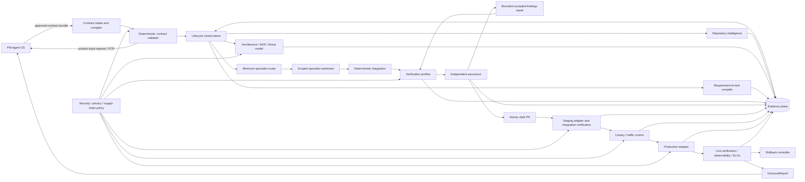
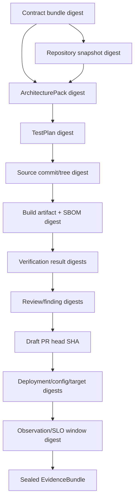
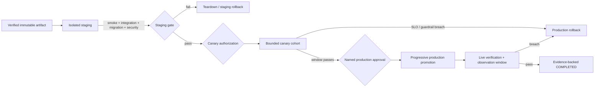

# Target architecture

## Architecture goals

Production Engineering OS (PEOS) consumes an approved PM Agent OS (PMOS) contract
bundle and produces a verified, deployable, observable product without inferring
missing business truth. The architecture separates:

- **control plane** — state, policy, permissions, budgets, approvals, stopping;
- **execution plane** — repository analysis, specialists, tests, build, deploy;
- **evidence plane** — content-addressed artifacts, test/review/deploy/observe proof;
- **security plane** — trust boundaries, least privilege, secrets, privacy, waivers.

Existing V1–V3 primitives are inputs to this target, not discarded systems.

## Component architecture

## Planes and component responsibilities

### Control plane

| Component | Responsibility | Existing foundation | Target addition |
|---|---|---|---|
| Contract intake | Load, version, digest, compile formats | `pmpe.contracts`, three schemas | Unified bundle/manifest and loss-aware compiler (#62) |
| Contract policy | Completeness, contradiction, ownership, approvals | schema validators, V1 `RequirementValidator` | Versioned rule registry and PM-owned blockers (#63) |
| Lifecycle engine | Legal transitions, actor permissions, resume | V1/V2/V3 state machines | One transition policy, migration, budgets, bounded repair (#65) |
| Authorization | Human approvals and agent/task/file scope | policy engine, production approval, fixer gate | Exact action/artifact/config/target subjects and expiry |
| Budget controller | Tokens, credits, time, attempts, external compute | ledger `cost` field only | Per-stage/run budgets and `BUDGET_EXCEEDED` |
| GitHub governor | Issue/branch/PR atomicity and draft state | local Git adapter and PR records | Issue-first remote adapter; no merge authority (#68) |

The control plane is the only component that changes lifecycle state. Model output is
an untrusted proposal until a deterministic admission rule accepts it.

### Execution plane

| Component | Responsibility | Existing foundation | Target addition |
|---|---|---|---|
| Repository intelligence | Exact-SHA read-only normalized snapshot | arbitrary V2 assessment | deterministic scanners/adapters (#64) |
| Architecture compiler | Components, boundaries, ADRs, threats, deployment/observe/rollback design | V1 templates, V2 architect | admitted ArchitecturePack (#66) |
| Test compiler | Requirements/criteria/risks/guardrails to executable evidence nodes | V1 stack templates, executed traceability | generalized TestPlan and meaningful-red gate (#67) |
| Specialist router | Minimum capable roster | V2 router | five missing profiles and runtime worktree spawning (#68) |
| Worktree executor | Test/implementation tasks with scoped writes | `specialist_worktree` | lifecycle-managed worktrees and task/file permissions |
| Integration | Compose branches, run full checks, freeze candidate | V2 integration agent/freeze | exact commit/build/config subject binding |
| Verification runner | Pinned unit/integration/E2E/migration/perf/a11y/security/privacy/boundary profiles | quality gates and product CI | normalized profiles, reproducible toolchains (#69/#70) |
| Deployment adapters | Execute staging/canary/production and rollback | real local deploy, preview, simulated production | real protected-environment adapters (#71/#72) |
| Guided Mode | Progressive-disclosure product-owner interface | CLI/skills | parity UI over the same APIs (#74) |

### Evidence plane

The EvidenceBundle is a content-addressed manifest. Each item records:

- evidence type and schema version;
- producer identity and role;
- command/tool/model/rule-set version;
- subject commit/tree/artifact/config/environment/deployment digest;
- input and output digests;
- start/end time using explicit UTC event timestamps;
- PASS/FAIL/BLOCKED/NOT_PROVEN result;
- raw artifact reference, retention class, and redaction status;
- supersedes/duplicate relationship.

Required bundle members are contract validation, repository snapshot, architecture,
ADRs, threat model, test plan, meaningful-red evidence, issue/branch/worktree record,
candidate/build/SBOM/provenance, verification results, independent reviews and
finding lifecycle, PR record, staging/canary/production/rollback evidence, live
SLO/guardrail window, and OutcomeReport.

Any changed upstream digest invalidates dependent evidence. Corrections create a new
manifest; sealed evidence is not overwritten.

### Security boundaries

| Boundary | Trust rule |
|---|---|
| PMOS → intake | Contract content is untrusted until schema, digest, approvals, ownership, and semantic rules pass. No secret values are permitted. |
| Agent → control plane | Agent artifacts are untrusted proposals. Deterministic admission, task/file scope, and product-boundary rules apply. |
| Reviewer → candidate | Reviewer is read-only, sees the frozen exact candidate, and is separate from fixer/verifier. Formal GitHub approval is a distinct human event. |
| PEOS → GitHub | Least-privilege token; issue/branch/draft-PR only by stage. No force-push, self-approval, or merge authority. |
| PEOS → build/dependency network | Pinned/locked sources, egress allowlist, SCA/SBOM/provenance, no credential persistence. |
| PEOS → staging/production | Short-lived target-scoped identity, protected environment, exact-subject approval, network/data policy, audit log. |
| Product → telemetry | Data allowlist/minimization, tenant separation, retention/deletion, redaction, access control. |
| Evidence storage | Append-only/content-addressed after sealing; sensitive references instead of values; approved retention. |

## Deployment architecture

The provider, protected environments, canary size/window, approvers, SLOs, RTO/RPO,
data rollback policy, and minimum observation window are human decisions. Until
provided, real deployment transitions are `BLOCKED`, not simulated successes.

## Observability architecture

All lifecycle and runtime events use correlation keys:

`contract_slice_id → run_id → issue → branch/worktree → commit/tree → build/SBOM →
PR → staging deployment → canary → production deployment → observation window →
OutcomeReport/PCR`.

Required telemetry classes:

- structured lifecycle and runtime logs with field allowlists;
- RED/USE or equivalent service metrics plus contract-approved business outcomes;
- distributed traces when an integration crosses process/service boundaries;
- SLO definitions and burn-rate/threshold evaluation;
- dashboards for delivery, release, SLO, security/privacy, cost, and autonomy;
- actionable alerts with owner, severity, deduplication, and runbook;
- rollback and incident events tied to the release;
- fleet aggregation for the metrics in `METRICS-AND-GATES.md`.

Vendor choice, data region, retention, and approved business signals are unresolved.

## PM Agent OS integration

### Inbound

PMOS sends:

1. bundle manifest and version;
2. product truth and traceable IDs;
3. approvals and approver roles;
4. outcome/leading/guardrail definitions and targets;
5. security/privacy/data intent;
6. release/observability/rollback intent.

PEOS returns `CONTRACT_INVALID` for structural/ownership violations and
`PRODUCT_INPUT_REQUIRED` for missing business truth. It never edits the approved
contract in place.

### Outbound

PEOS returns:

- validation diagnostics and ProductInputRequest;
- ArchitectureDecisionRequest for cross-boundary decisions;
- ProductChangeRequest for engineering-discovered product changes;
- release/incident/rollback evidence;
- OutcomeReport comparing hypothesis, outcome, metrics, guardrails, and SLO evidence;
- recommended options and engineering consequences, never an automatic product
  decision.

## Lifecycle state machine

### State invariants

- State and transition policy are versioned and stored outside chat.
- Every transition names its actor and exact evidence subjects.
- Unsupported infrastructure produces `BLOCKED`, not PASS.
- Repair attempts consume approved budgets and cannot weaken gates/tests.
- Production/canary/staging execution is distinct from policy simulation.
- `COMPLETED` requires deterministic contract, commit/build, verification, review,
  deployment, live observation, and rollback-readiness evidence. Model output alone
  can never satisfy a transition.

### Transition table

Abbreviations: **CP** control plane; **PM** named product owner; **EO** engineering
owner; **SO** security/operations owner; **HA** explicit human approval.

| From → next | Required input | Required evidence | Responsible actor and permitted action | Failure condition and rollback behavior | HA |
|---|---|---|---|---|---|
| `CONTRACT_RECEIVED → CONTRACT_INVALID` | Bundle bytes/manifest | Parse/schema/compiler diagnostics and source digest | CP validates only | Malformed, unsupported, lossy, ownership-invalid. No stateful work started; return diagnostics. | No |
| `CONTRACT_INVALID → CONTRACT_RECEIVED` | New version/corrected bundle | New source/version/digest and PM approval | PM submits; CP never edits old bundle | Same version with changed digest is refused; old record retained. | PM approval |
| `CONTRACT_RECEIVED → PRODUCT_INPUT_REQUIRED` | Structurally valid bundle | Named completeness/contradiction rules and field paths | CP requests missing product truth | Missing/contradictory product truth. No architecture/implementation; resume target recorded. | PM response |
| `PRODUCT_INPUT_REQUIRED → CONTRACT_RECEIVED` | Superseding bundle/PCR decision | Resolution, approver, new version/digest | PM decides and resubmits | Unresolved/unauthorized answer remains blocked; old version retained. | Yes |
| `CONTRACT_RECEIVED → CONTRACT_APPROVED` | Valid complete approved bundle | 100% contract gates, rule-set digest, approval metadata | CP admits and locks | Any blocker routes to invalid/input-required; no rollback needed. | Existing PM approval required |
| `CONTRACT_APPROVED → REPOSITORY_ANALYSED` | Locked contract and repository ref | Exact-SHA read-only RepositorySnapshot and scanner versions | CP invokes read-only repository intelligence | Dirty/unsupported/inaccessible critical facts → `BLOCKED`; discard partial recommendation, retain scan evidence. | No |
| `CONTRACT_APPROVED → BLOCKED` | Contract plus missing adapter/permission | Blocker owner, attempted evidence, resume target | CP stops; owner may provision/authorize | No repository mutation; resume from approved contract. | Depends on blocker |
| `BLOCKED →` recorded resume state | Resolved external state or approved superseding input | Resolution identity, changed external-state evidence, unchanged upstream digests | CP rechecks then resumes exact prior gate | Recheck failure remains blocked; no skip. | If permission/decision |
| `REPOSITORY_ANALYSED → ARCHITECTURE_PROPOSED` | Contract + snapshot | ArchitecturePack, ADRs, threat model, all digests | Architect proposes; CP admits structure/references | Missing/invalid pack remains analysed; no implementation. | No |
| `ARCHITECTURE_PROPOSED → PRODUCT_INPUT_REQUIRED` | Cross-boundary/irreversible finding | Decision request with options/consequences | CP/architect requests PM/security/ops decision | Never choose vendor, retention, UX, cost, or irreversible behavior by default. | Yes |
| `ARCHITECTURE_PROPOSED → ARCHITECTURE_APPROVED` | Admitted pack and resolved escalations | Engineering review, boundary policy, required approvals | EO approves technical design; CP locks pack | Rejected design returns to proposed; superseding pack invalidates downstream. | EO; PM/SO where boundary crossed |
| `ARCHITECTURE_APPROVED → TEST_PLAN_CREATED` | Locked contract/snapshot/architecture | TestPlan and coverage matrix digests | Test compiler proposes only | Unsupported test infrastructure → `BLOCKED`; missing product test oracle → input-required. | No |
| `TEST_PLAN_CREATED → TEST_PLAN_VALIDATED` | TestPlan and toolchain inventory | 100% required-ID mapping, applicability rules, planned meaningful-red evidence | CP/test validator admits | Missing/vague evidence mapping returns to created/input-required; no code. | No |
| `TEST_PLAN_CREATED → PRODUCT_INPUT_REQUIRED` | Missing acceptance oracle/threshold | Named unmapped IDs and questions | CP requests PM truth | Resume with superseding contract; downstream plan invalidated. | Yes |
| `TEST_PLAN_VALIDATED → IMPLEMENTATION_PLANNED` | Approved issue candidates and architecture/test plan | Ordered atomic tasks, dependencies, file/task scopes, rollback per task | Planner proposes; CP admits | Non-atomic/uncovered task plan refused; remain validated. | EO for plan exceptions |
| `IMPLEMENTATION_PLANNED → IMPLEMENTATION_IN_PROGRESS` | Ready GitHub issue, dedicated branch/worktrees, budgets | Issue/branch/worktree records; meaningful-red execution where required | CP authorizes minimum specialists | Missing issue, stale base, scope/budget/permission failure → `BLOCKED`; dispose worktree safely. | No |
| `IMPLEMENTATION_IN_PROGRESS → VERIFICATION_FAILED` | Integrated candidate | Exact-SHA verification results | Verification runner executes only | Any required check FAIL/NOT_PROVEN; candidate not publishable. Roll back disposable integration/worktree as needed. | No |
| `IMPLEMENTATION_IN_PROGRESS → REVIEW_REQUIRED` | Integrated candidate with all deterministic gates pass | Frozen commit/tree/build/SBOM, test results, preliminary EvidenceBundle | CP freezes and opens review stage | Digest drift returns to verification; no PR readiness. | No |
| `VERIFICATION_FAILED → REPAIR_IN_PROGRESS` | Accepted engineering findings within scope/budget | Finding status, fixer/task/file allowlist, remaining attempts/cost | CP authorizes fixer only | Product finding → input-required; exhausted budget → budget-exceeded; unrepairable → blocked. | Owner decision for non-mechanical finding |
| `REPAIR_IN_PROGRESS → VERIFICATION_FAILED` | Candidate changed by scoped fixes | Fix commits/files/checks and new candidate digest | Independent verifier reruns full affected and required gates | Any failure stays verification-failed; never weaken test/gate. | No |
| `REPAIR_IN_PROGRESS → REVIEW_REQUIRED` | All fixes verified and all gates green | New exact-SHA EvidenceBundle and fixer ≠ verifier proof | CP refreezes and requests fresh review | Stale previous review is invalid; digest drift returns to verification. | No |
| `VERIFICATION_FAILED → BUDGET_EXCEEDED` | Exhausted attempt/time/token/credit/external-compute budget | Budget policy, consumption ledger, last safe state | CP stops; only report/rollback/dispose actions allowed | No further repair. Worktrees disposed or retained per evidence policy. | Budget extension requires named owner |
| `BUDGET_EXCEEDED → REPAIR_IN_PROGRESS` | Approved budget extension with unchanged scope | Named reason/new budget and unchanged upstream digests | CP resumes one bounded attempt set | Changed product scope requires new contract; invalid extension remains stopped. | Yes |
| `BUDGET_EXCEEDED → BLOCKED` | No extension or external dependency | Terminal report and resume conditions | CP closes active execution safely | No completion claim. | No |
| `REVIEW_REQUIRED → REVIEW_FAILED` | Frozen candidate and required reviewer roster | Read-only proofs, exact candidate reviews, credible findings | Independent reviewers analyze only | Critical/high/credible-medium or integrity failure blocks. No reviewer fix. | Finding decisions by owner |
| `REVIEW_FAILED → REPAIR_IN_PROGRESS` | Reconciled accepted engineering findings and budget | Decisions/reasons, fixer scope, PCRs for product findings | CP authorizes fixer | Undecided/product findings remain failed/input-required; stale candidate forbidden. | Yes for non-mechanical decisions |
| `REVIEW_FAILED → PRODUCT_INPUT_REQUIRED` | Product-decision finding | PCR linked to contract/requirements | PM decides; CP does not fix | Superseding contract returns to contract intake and invalidates downstream. | Yes |
| `REVIEW_REQUIRED → PR_READY` | All reviews complete and blocking findings resolved | Exact-SHA sealed pre-release EvidenceBundle, atomicity/issue/PR metadata, checks | CP may create/update **draft** PR only | Missing formal-review requirement remains review-required; no self-approval/merge. | Formal review if repository policy requires |
| `PR_READY → STAGING_DEPLOYED` | Approved staging action and immutable artifact/config | Real environment deployment ID and digest match | Deployment adapter deploys only | Adapter/infrastructure/check failure → `STAGING_FAILED`; teardown/rollback. | Per environment policy |
| `PR_READY → STAGING_FAILED` | Staging attempt | Failed deploy/check and cleanup evidence | CP records failure only | Candidate repair or infrastructure block; no canary. | No |
| `STAGING_FAILED → REPAIR_IN_PROGRESS` | Accepted code/config finding in budget | Failure mechanism and scoped fix | CP authorizes repair | Infrastructure-only problem → blocked; staging teardown required. | Owner for classification |
| `STAGING_FAILED → BLOCKED` | Missing/broken infrastructure or failed cleanup | Blocker/owner/environment state | CP stops and protects environment | Human resolves; resume at staging with same exact artifact or reverify changed one. | Often SO |
| `STAGING_DEPLOYED → CANARY_DEPLOYED` | Staging pass, canary authorization, policy | Staging EvidenceBundle, bounded cohort/traffic/window, rollback readiness | Traffic/deploy adapter exposes canary only | Failure to deploy or any guardrail breach → `CANARY_FAILED`. | Per approved canary policy |
| `CANARY_DEPLOYED → CANARY_FAILED` | Canary telemetry window | Exact deploy, SLO/guardrail breach and detection evidence | CP aborts promotion and starts rollback | Immediate rollback; no averaging away critical breach. | No |
| `CANARY_FAILED → ROLLBACK_IN_PROGRESS` | Abort decision and rollback subject | Last-known-good/migration compatibility/runbook | Rollback adapter executes only | Rollback failure → `BLOCKED` with incident escalation. | No; pre-authorized emergency action |
| `CANARY_DEPLOYED → PRODUCTION_APPROVAL_REQUIRED` | Successful complete canary window | All canary gates, no unresolved findings, exact subjects | CP requests named production approval | No approval means wait/expire; canary remains bounded or is removed by policy. | Yes |
| `PRODUCTION_APPROVAL_REQUIRED → PRODUCTION_DEPLOYED` | Named approval bound to artifact/config/migration/target/policy | Approval identity/time/reason/digests and protected-environment authorization | Production adapter progressively promotes | Stale/mismatched/expired approval refused; no deployment. | Yes |
| `PRODUCTION_APPROVAL_REQUIRED → BLOCKED` | Rejection/expiry/missing approver | Decision/reason and safe canary teardown | CP stops promotion | No completion; resume needs new exact approval after revalidation. | Yes |
| `PRODUCTION_DEPLOYED → LIVE_VERIFICATION_FAILED` | Live health/journey/SLO/business/privacy/security window | Runtime telemetry and exact deployment correlation | CP evaluates; no model verdict | Any hard breach/missing required signal starts rollback. | No |
| `LIVE_VERIFICATION_FAILED → ROLLBACK_IN_PROGRESS` | Failed live gate | Failure, last-known-good, rollback/migration plan | Rollback adapter executes | Rollback failure → blocked/incident; never completed. | No |
| `ROLLBACK_IN_PROGRESS → ROLLED_BACK` | Completed rollback | Service/data verification, RTO/RPO, traffic/config state, incident link | CP verifies restored state | Verification failure → blocked; continue incident response. | No |
| `ROLLED_BACK → REPAIR_IN_PROGRESS` | Approved follow-up within original product scope/budget | Incident finding and scoped repair plan | CP may create new candidate path | Product/architecture change → new contract/PCR; otherwise bounded repair. | Owner decision |
| `PRODUCTION_DEPLOYED → COMPLETED` | Full observation window passed | Exact production subjects, acceptance/SLO/guardrail PASS, complete sealed EvidenceBundle, rollback readiness, OutcomeReport | CP alone records terminal completion | Missing/invalid/stale/model-only evidence routes to live-verification-failed or blocked. | Prior production approval already required |

Any non-terminal state may transition to `BLOCKED` for an external dependency or to
`BUDGET_EXCEEDED` when its approved budget is exhausted. Both record the exact resume
state; neither permits implementation, deployment, or completion while unresolved.
