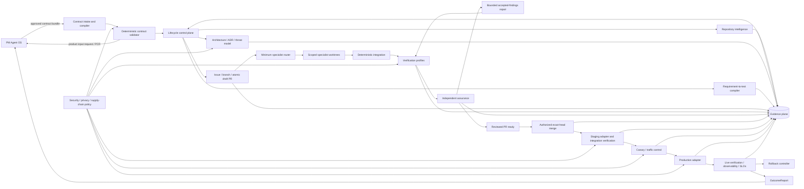
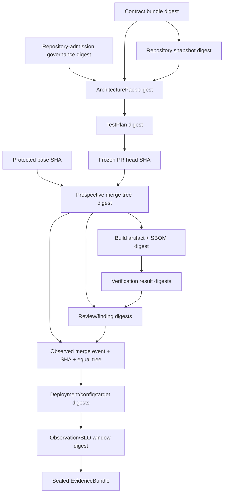
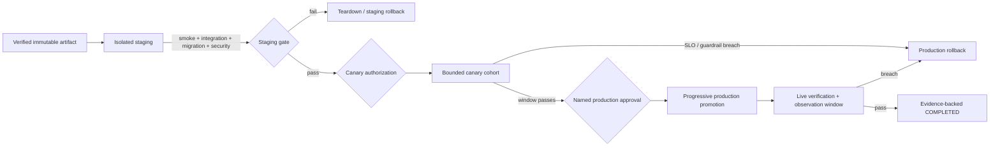

# Target architecture

## Architecture goals

Production Engineering OS (PEOS) consumes an approved PM Agent OS (PMOS) contract
bundle and produces a verified, deployable, observable product without inferring
missing business truth. The architecture separates:

- **control plane** — state, policy, permissions, budgets, approvals, stopping;
- **execution plane** — repository analysis, specialists, tests, build, deploy;
- **evidence plane** — content-addressed artifacts, test/review/deploy/observe proof;
- **security plane** — trust boundaries, least privilege, secrets, privacy, waivers.

Existing V1–V3 primitives are inputs to this target, not discarded systems.

## Component architecture

## Planes and component responsibilities

### Control plane

| Component | Responsibility | Existing foundation | Target addition |
|---|---|---|---|
| Contract intake | Load, version, digest, compile formats | `pmpe.contracts`, three schemas | Canonical bundle/manifest schema (#62) and loss-aware compiler (#76) |
| Contract policy | Completeness, contradiction, ownership, approvals | schema validators, V1 `RequirementValidator` | Versioned rule registry and PM-owned blockers (#63) |
| Lifecycle engine | Legal transitions, actor permissions, resume | V1/V2/V3 state machines | One transition policy, migration, budgets, bounded repair (#65) |
| Authorization | Human approvals and agent/task/file scope | policy engine, production approval, fixer gate | Exact action/artifact/config/target subjects and expiry |
| Budget controller | Tokens, credits, time, attempts, external compute | ledger `cost` field only | Per-stage/run budgets and `BUDGET_EXCEEDED` |
| GitHub governor | Issue/branch/PR atomicity and draft state | local Git adapter and PR records | Issue-first remote adapter with no direct merge authority plus protected-branch merge queue/compare-and-swap admission for the reviewed head/base/tree (#68/#69) |

The control plane is the only component that changes lifecycle state. Model output is
an untrusted proposal until a deterministic admission rule accepts it.

### Execution plane

| Component | Responsibility | Existing foundation | Target addition |
|---|---|---|---|
| Repository intelligence | Exact-SHA read-only normalized content snapshot plus separately versioned governance observation | arbitrary V2 assessment | deterministic scanners/adapters (#64) |
| Architecture compiler | Components, boundaries, ADRs, threats, deployment/observe/rollback design | V1 templates, V2 architect | admitted ArchitecturePack (#66) |
| Test compiler | Requirements/criteria/risks/guardrails to executable evidence nodes | V1 stack templates, executed traceability | generalized TestPlan and meaningful-red gate (#67) |
| Specialist router | Minimum capable roster | V2 router | five missing profiles and runtime worktree spawning (#68) |
| Worktree executor | Test/implementation tasks with scoped writes | `specialist_worktree` | lifecycle-managed worktrees and task/file permissions |
| Integration | Compose branches, run full checks, freeze candidate | V2 integration agent/freeze | exact commit/build/config subject binding |
| Verification runner | Pinned unit/integration/E2E/migration/perf/a11y/security/privacy/boundary profiles | quality gates and product CI | normalized profiles, reproducible toolchains (#69/#70) |
| Deployment adapters | Execute staging/canary/production and rollback | real local deploy, preview, simulated production | real protected-environment adapters (#71/#72) |
| Guided Mode | Progressive-disclosure product-owner interface | CLI/skills | parity UI over the same APIs (#74) |

### Evidence plane

The EvidenceBundle is a content-addressed manifest with two deliberately separate
layers:

1. A replay-stable semantic claim records the evidence type/schema, producer role,
   command/tool/model/rule-set versions, subject and input/output digests,
   and a policy-selected execution-environment fingerprint. The fingerprint includes
   applicable OS/distribution and architecture, language/runtime, executable/tool and
   dependency-resolution/lock digests, container or runner image digest, locale/timezone,
   relevant non-secret environment/configuration/policy digests, and hardware class for
   hardware-sensitive checks. Secret references are digested identifiers, never values.
   The claim also records its PASS/FAIL/BLOCKED/NOT_PROVEN result, any schema-defined
   canonical result digest, and versioned retention/redaction policy. Its canonical
   semantic digest excludes run-instance metadata and non-canonical raw logs.
2. An append-only event envelope records producer instance identity, run/attempt ID,
   runner/host identity, explicit UTC start/end timestamps, raw-artifact location and
   digest, and supersedes/duplicate relationships. The envelope has its own audit
   digest and references the semantic digest.

A bundle's replay-stable digest is calculated from the sorted semantic member digests
and stable subject/profile references. Audit envelopes are retained and integrity
checked but do not change semantic replay equality merely because the same work ran
later. Deterministic replay compares semantic, subject, input, and output digests;
run-instance timestamps are expected to differ. An environment-sensitive claim is
inapplicable—not equivalent—when its required environment fingerprint differs or is
missing.

Evidence completeness uses stage-specific profiles. Each checkpoint seals a new
content-addressed EvidenceBundle that references and supersedes the prior stage bundle:

| Profile | Required members added at this stage |
|---|---|
| Contract admission | contract source/version/digest, validation, approvals, and rule-set digest |
| Pre-code | exact-SHA repository snapshot; repository-admission governance observation ID/digest/timestamp/query provenance; architecture, ADRs, threat model, TestPlan, issue/branch/draft-PR record; post-creation governance checkpoint; and meaningful-red evidence |
| Candidate review | exact PR head, protected-base SHA, prospective merge-tree digest, fresh candidate governance checkpoint, build/SBOM/provenance, deterministic verification, independent reviews, and finding lifecycle |
| Merge admission | reviewed head/base/prospective tree, required checks/approvals, merge actor/time/method/SHA/tree equality, and primary issue linkage |
| Staging | immutable artifact/config/target, deployment, integration, migration, smoke, security, and teardown/rollback readiness |
| Canary | bounded cohort/traffic policy, deployment, complete SLO/guardrail window, abort decision, and rollback readiness |
| Production authorization | named approval bound to merge/artifact/config/migration/target/rollout subjects |
| Production deployment | progressive deployment, exact subject correlation, and rollback target |
| Rollback and incident | exact failed deployment/exposure and last-known-good subjects, pre-recorded rollback attempt/idempotency key, executed steps, restored traffic/config/service/data state, RTO/RPO result, post-rollback verification, and incident/decision evidence |
| Completion | live SLO/guardrail observation window, acceptance evidence, final rollback readiness, and OutcomeReport |

A gate requires 100% of the members in its current and preceding applicable profiles,
not artifacts from future stages. Thus an MVP draft PR can seal a complete candidate
review bundle without pretending that production evidence already exists.

Governance observations are checkpoint-scoped. Repository admission records the
baseline; issue/branch/draft-PR creation, candidate freeze, readiness, and merge
admission each append a fresh observation. A transition declares its expected
lifecycle-owned effects (for example, creating the admitted branch and draft PR). When
the observed delta exactly matches that effect manifest and the protected base,
repository content, toolchain, protection policy, and other dependencies are unchanged,
the new observation supersedes the prior governance member without invalidating
architecture or TestPlan evidence. An unexpected dirty/index/worktree change, target
base movement, protection/ruleset change, conflicting PR/branch, remote change, or
unexplained query gap invalidates the evidence nodes that depend on it and returns to
the appropriate re-admission gate.

Any other changed upstream digest invalidates dependent evidence. Corrections create a
new manifest; sealed evidence is not overwritten.

### Security boundaries

| Boundary | Trust rule |
|---|---|
| PMOS → intake | Contract content is untrusted until schema, digest, approvals, ownership, and semantic rules pass. No secret values are permitted. |
| Agent → control plane | Agent artifacts are untrusted proposals. Deterministic admission, task/file scope, and product-boundary rules apply. |
| Reviewer → candidate | Reviewer is read-only, sees the frozen exact candidate, and is separate from fixer/verifier. Formal GitHub approval is a distinct human event. |
| PEOS → GitHub | Least-privilege token; issue/branch/draft-PR only by stage. No force-push, self-approval, or merge authority. |
| PEOS → build/dependency network | Pinned/locked sources, egress allowlist, SCA/SBOM/provenance, no credential persistence. |
| PEOS → staging/production | Short-lived target-scoped identity, protected environment, exact-subject approval, network/data policy, audit log. |
| Product → telemetry | Data allowlist/minimization, tenant separation, retention/deletion, redaction, access control. |
| Evidence storage | Append-only/content-addressed after sealing; sensitive references instead of values; approved retention. |

## Deployment architecture

The provider, protected environments, canary size/window, approvers, SLOs, RTO/RPO,
data rollback policy, and minimum observation window are human decisions. Until
provided, real deployment transitions are `BLOCKED`, not simulated successes.

## Observability architecture

All lifecycle and runtime events use correlation keys:

`contract_slice_id → run_id → issue → branch/worktree → commit/tree → build/SBOM →
PR → staging deployment → canary → production deployment → observation window →
OutcomeReport/PCR`.

Required telemetry classes:

- structured lifecycle and runtime logs with field allowlists;
- RED/USE or equivalent service metrics plus contract-approved business outcomes;
- distributed traces when an integration crosses process/service boundaries;
- SLO definitions and burn-rate/threshold evaluation;
- dashboards for delivery, release, SLO, security/privacy, cost, and autonomy;
- actionable alerts with owner, severity, deduplication, and runbook;
- rollback and incident events tied to the release;
- fleet aggregation for the metrics in `METRICS-AND-GATES.md`.

Vendor choice, data region, retention, and approved business signals are unresolved.

## PM Agent OS integration

### Inbound

PMOS sends:

1. bundle manifest and version;
2. product truth and traceable IDs;
3. approvals and approver roles;
4. outcome/leading/guardrail definitions and targets;
5. security/privacy/data intent;
6. release/observability/rollback intent.

PEOS returns `CONTRACT_INVALID` for structural/ownership violations and
`PRODUCT_INPUT_REQUIRED` for missing business truth. It never edits the approved
contract in place.

### Outbound

PEOS returns:

- validation diagnostics and ProductInputRequest;
- ArchitectureDecisionRequest for cross-boundary decisions;
- ProductChangeRequest for engineering-discovered product changes;
- release/incident/rollback evidence;
- OutcomeReport comparing hypothesis, outcome, metrics, guardrails, and SLO evidence;
- recommended options and engineering consequences, never an automatic product
  decision.

## Lifecycle state machine

### State invariants

- State and transition policy are versioned and stored outside chat.
- Every transition names its actor and exact evidence subjects.
- Unsupported infrastructure produces `BLOCKED`, not PASS.
- Repair attempts consume approved budgets and cannot weaken gates/tests.
- Production/canary/staging execution is distinct from policy simulation.
- Before any deployment, traffic, configuration, data, teardown, or rollback mutation,
  CP durably records an exact-subject idempotency key and attempt/step plan. Adapters
  append completed/unknown steps; interruption or a missing result is reconciled as
  indeterminate exposure and fails closed. This journal is never inferred after the
  mutation.
- `COMPLETED` requires deterministic contract, commit/build, verification, review,
  deployment, live observation, and rollback-readiness evidence. Model output alone
  can never satisfy a transition.
- `COMPLETED` is a revocable current claim, not an absorbing state. The original
  append-only completion event remains historical evidence, while its separately
  versioned claim status can become `revoked` and transition to live-failure or blocked
  handling when evidence is invalidated.

### Transition table

Abbreviations: **CP** control plane; **PM** named product owner; **EO** engineering
owner; **SO** security/operations owner; **HA** explicit human approval.

| From → next | Required input | Required evidence | Responsible actor and permitted action | Failure condition and rollback behavior | HA |
|---|---|---|---|---|---|
| `CONTRACT_RECEIVED → CONTRACT_INVALID` | Bundle bytes/manifest | Parse/schema/compiler diagnostics and source digest | CP validates only | Malformed, unsupported, lossy, ownership-invalid. No stateful work started; return diagnostics. | No |
| `CONTRACT_INVALID → CONTRACT_RECEIVED` | New version/corrected bundle | New source/version/digest and PM approval | PM submits; CP never edits old bundle | Same version with changed digest is refused; old record retained. | PM approval |
| `CONTRACT_RECEIVED → PRODUCT_INPUT_REQUIRED` | Structurally valid bundle | Named completeness/contradiction rules and field paths | CP requests missing product truth | Missing/contradictory product truth. No architecture/implementation; resume target recorded. | PM response |
| `PRODUCT_INPUT_REQUIRED → CONTRACT_RECEIVED` | Superseding bundle/PCR decision and, when downstream work exists, its issue/branch/draft-PR/worktree disposition | Resolution, approver, new version/digest, atomic-scope comparison, and durable disposition record | PM decides; CP halts worktrees and either reuses the same issue/branch/draft PR when the atomic outcome is unchanged or marks them superseded and requires a new issue/primary PR when scope changed | Unresolved/unauthorized input or any undispositioned active candidate remains product-input-required; old contract/candidate evidence is retained and cannot execute. | Yes |
| `CONTRACT_RECEIVED → CONTRACT_APPROVED` | Valid complete approved bundle | 100% contract gates, rule-set digest, approval metadata | CP admits and locks | Any blocker routes to invalid/input-required; no rollback needed. | Existing PM approval required |
| `CONTRACT_APPROVED → REPOSITORY_ANALYSED` | Locked contract and repository ref | Exact-SHA read-only RepositorySnapshot and scanner versions plus a separately versioned GovernanceObservation with ID, digest, observation time, query provenance, dirty/index/worktree state, current branch, remotes, and observable live branch/PR/protection facts | CP invokes read-only repository intelligence and admits content facts separately from mutable governance facts | Dirty/unsupported/inaccessible or stale critical facts, or missing governance query provenance → `BLOCKED`; discard partial recommendation, retain scan/observation evidence. | No |
| `CONTRACT_APPROVED → BLOCKED` | Contract plus missing adapter/permission | Blocker owner, attempted evidence, resume target | CP stops; owner may provision/authorize | No repository mutation; resume from approved contract. | Depends on blocker |
| `BLOCKED → <recorded resume state>` | External dependency/permission resolved with every upstream contract/repository/base/candidate digest unchanged and no unresolved environment exposure | Resolution identity, changed external-state evidence, prior state/action, zero-exposure or completed-rollback proof where relevant, and unchanged upstream digests | CP rechecks then resumes the exact interrupted gate | Recheck failure remains blocked; changed inputs must use an invalidation transition below; no skip to a later or terminal state. | If permission/decision |
| `BLOCKED → CONTRACT_RECEIVED` | Approved superseding contract, product decision, or scope input and no unresolved environment exposure | New source/version/digest/approval, changed-input classification, append-only invalidation of all dependent evidence, and issue/branch/PR/worktree disposition | PM submits; CP routes through contract intake from the beginning and never resumes the interrupted downstream gate | Missing approval/disposition or active/indeterminate exposure remains blocked; old evidence is retained but cannot execute. | Yes |
| `BLOCKED → REPOSITORY_ANALYSED` | Contract unchanged but repository/base/toolchain/governance input changed, no unresolved environment exposure, and a fresh exact-SHA RepositorySnapshot plus current GovernanceObservation are available | Old/new input digests, changed-input classification, invalidated downstream evidence, active-work disposition, fresh snapshot/scanner versions, and governance observation ID/digest/time/query provenance | CP separately re-admits content and mutable governance facts, then requires architecture and every downstream artifact to be reproposed/revalidated | Contract/product change uses contract intake; missing safe-state proof, snapshot, or current governance provenance remains blocked. | Owner for change classification |
| `REPOSITORY_ANALYSED → ARCHITECTURE_PROPOSED` | Contract + snapshot + admitted repository-governance baseline | ArchitecturePack, ADRs, threat model, contract/snapshot/governance input digests | Architect proposes; CP admits structure/references | Missing/invalid pack or unexpected baseline drift remains analysed or returns to repository admission; no implementation. | No |
| `ARCHITECTURE_PROPOSED → PRODUCT_INPUT_REQUIRED` | Cross-boundary/irreversible finding | Decision request with options/consequences | CP/architect requests PM/security/ops decision | Never choose vendor, retention, UX, cost, or irreversible behavior by default. | Yes |
| `ARCHITECTURE_PROPOSED → ARCHITECTURE_APPROVED` | Admitted pack and resolved escalations | Engineering review, boundary policy, required approvals | EO approves technical design; CP locks pack | Rejected design returns to proposed; superseding pack invalidates downstream. | EO; PM/SO where boundary crossed |
| `ARCHITECTURE_APPROVED → TEST_PLAN_CREATED` | Locked contract/snapshot/architecture | TestPlan and coverage matrix digests | Test compiler proposes only | Unsupported test infrastructure → `BLOCKED`; missing product test oracle → input-required. | No |
| `ARCHITECTURE_APPROVED → PRODUCT_INPUT_REQUIRED` | Test compilation discovers that an approved product acceptance oracle, threshold, edge behavior, or applicability decision is missing before a valid TestPlan can be created | ProductInputRequest linked to contract/requirement/criterion, compiler diagnostic and rule-set digest, architecture/test-attempt references, and recorded resume target | CP requests PM truth and admits no incomplete TestPlan; the compiler and architect may describe consequences but cannot choose product behavior | Remains product-input-required until an approved superseding contract returns through intake; architecture and downstream evidence are invalidated according to changed inputs. | Yes |
| `TEST_PLAN_CREATED → TEST_PLAN_VALIDATED` | TestPlan and toolchain inventory | 100% required-ID mapping, applicability rules, planned meaningful-red evidence | CP/test validator admits | Missing/vague evidence mapping returns to created/input-required; no code. | No |
| `TEST_PLAN_CREATED → PRODUCT_INPUT_REQUIRED` | Missing acceptance oracle/threshold | Named unmapped IDs and questions | CP requests PM truth | Resume with superseding contract; downstream plan invalidated. | Yes |
| `TEST_PLAN_VALIDATED → IMPLEMENTATION_PLANNED` | Approved issue candidates and architecture/test plan | Ordered atomic tasks, dependencies, file/task scopes, rollback per task | Planner proposes; CP admits | Non-atomic/uncovered task plan refused; remain validated. | EO for plan exceptions |
| `IMPLEMENTATION_PLANNED → DRAFT_PR_OPEN` | Ready GitHub issue, dedicated branch, admitted atomic plan, prior governance observation, and any reuse/supersede disposition | Expected-effect manifest; GitHub issue/branch, initial planning/test commit, atomic draft PR, base/head, rollback record, created-versus-reused decision; and post-creation governance observation ID/digest/time/query provenance | CP creates a draft PR when none exists or idempotently re-admits the dispositioned existing primary PR when the atomic outcome/metadata match; it admits only the expected governance delta and never marks ready, approves, or merges | Missing issue, target-base/protection drift, non-atomic scope, unexpected dirty or remote change, conflicting primary PR, mismatched reuse metadata, query gap, or PR failure → `BLOCKED` or repository re-admission as classified; no implementation starts. | No |
| `DRAFT_PR_OPEN → IMPLEMENTATION_IN_PROGRESS` | Draft PR, isolated worktrees, budgets, validated TestPlan, and current post-creation governance checkpoint | PR/branch/worktree records; meaningful-red execution where required; governance delta matches the admitted lifecycle effect manifest | CP authorizes minimum specialists | Scope/budget/permission/test-order failure or unexpected governance drift → `BLOCKED`/re-admission; dispose worktree safely without deleting evidence. | No |
| `IMPLEMENTATION_IN_PROGRESS → VERIFICATION_FAILED` | Integrated candidate | Exact-SHA verification results | Verification runner executes only | Any required check FAIL/NOT_PROVEN; candidate not publishable. Roll back disposable integration/worktree as needed. | No |
| `IMPLEMENTATION_IN_PROGRESS → REVIEW_REQUIRED` | Integrated candidate with all deterministic gates pass | Frozen commit/tree/build/SBOM, test results, preliminary EvidenceBundle | CP freezes and opens review stage | Digest drift returns to verification; no PR readiness. | No |
| `VERIFICATION_FAILED → REPAIR_IN_PROGRESS` | Accepted engineering findings within scope/budget | Finding status, fixer/task/file allowlist, remaining attempts/cost | CP authorizes fixer only | Product finding → input-required; exhausted budget → budget-exceeded; unrepairable → blocked. | Owner decision for non-mechanical finding |
| `VERIFICATION_FAILED → PRODUCT_INPUT_REQUIRED` | Product-level finding or missing acceptance oracle discovered by verification | Finding/PCR linked to contract, requirement, failed proof, active issue/branch/draft PR, and stopped worktree record | CP requests PM truth, halts worktrees, and marks the existing draft PR/issue blocked on product input; no fixer may decide it | Superseding contract returns through intake and invalidates downstream evidence; it must satisfy the explicit reuse-or-supersede disposition before work resumes. | Yes |
| `REPAIR_IN_PROGRESS → VERIFICATION_FAILED` | Candidate changed by scoped fixes | Fix commits/files/checks and new candidate digest | Independent verifier reruns full affected and required gates | Any failure stays verification-failed; never weaken test/gate. | No |
| `REPAIR_IN_PROGRESS → REVIEW_REQUIRED` | All fixes verified and all gates green | New exact-SHA EvidenceBundle and fixer ≠ verifier proof | CP refreezes and requests fresh review | Stale previous review is invalid; digest drift returns to verification. | No |
| `VERIFICATION_FAILED → BUDGET_EXCEEDED` | Exhausted attempt/time/token/credit/external-compute budget | Budget policy, consumption ledger, last safe state | CP stops; only report/rollback/dispose actions allowed | No further repair. Worktrees disposed or retained per evidence policy. | Budget extension requires named owner |
| `BUDGET_EXCEEDED → <recorded resume state>` | Approved budget extension with unchanged scope | Named reason/new budget, interrupted state/action, and unchanged upstream digests | CP rechecks and resumes exactly the interrupted state; it cannot choose a later state | Changed product scope requires new contract; invalid extension remains stopped. Never default to repair without a candidate. | Yes |
| `BUDGET_EXCEEDED → BLOCKED` | No extension or external dependency | Terminal report and resume conditions | CP closes active execution safely | No completion claim. | No |
| `REVIEW_REQUIRED → REVIEW_FAILED` | Frozen candidate and required reviewer roster | Read-only proofs, exact candidate reviews, credible findings | Independent reviewers analyze only | Critical/high/credible-medium or integrity failure blocks. No reviewer fix. | Finding decisions by owner |
| `REVIEW_FAILED → REPAIR_IN_PROGRESS` | Reconciled accepted engineering findings and budget | Decisions/reasons, fixer scope, PCRs for product findings | CP authorizes fixer | Undecided/product findings remain failed/input-required; stale candidate forbidden. | Yes for non-mechanical decisions |
| `REVIEW_FAILED → PRODUCT_INPUT_REQUIRED` | Product-decision finding | PCR linked to contract/requirements, active issue/branch/draft PR, and stopped worktree record | CP halts execution and marks the existing draft PR/issue blocked on product input; PM decides and CP does not fix | Superseding contract returns to intake and invalidates downstream evidence; reuse or supersession must be recorded before another primary PR can exist. | Yes |
| `REVIEW_FAILED → REVIEW_REQUIRED` | Every blocking finding is dispositioned without a source change | Unchanged candidate digest, authorized `rejected-with-reason` records, independent disposition validation, and no unresolved finding | CP reopens readiness evaluation on the same frozen candidate; reviewers do not create a no-op repair | Missing authority/evidence or any accepted finding stays failed and uses repair/input-required. | Finding owner; independent validation |
| `REVIEW_REQUIRED → PR_READY` | Existing draft PR, all reviews complete, blocking findings resolved against a frozen protected base, and policy authorization to invoke GitHub's ready-for-review action | Sealed candidate-review EvidenceBundle for the exact PR head + base + prospective merge-tree digest, pre-action governance checkpoint, atomicity/issue/PR metadata, checks, formal review when required, expected-effect manifest for draft → ready, ready actor/time/event, and post-action governance checkpoint ID/digest/time/query provenance | CP seals eligibility; an eligible maintainer or narrowly scoped GitHub governor invokes ready-for-review only for that exact authorized PR/head; CP observes the non-draft result and admits `PR_READY`. Neither actor approves or merges through this transition | Missing review/check/evidence/authorization, an unchanged draft flag, or unexpected governance drift remains review-required or returns to repository re-admission; no self-approval/merge. | Formal review and ready actor as policy requires |
| `PR_READY → REPOSITORY_ANALYSED` | Protected base, merge policy/toolchain input, or prospective merge tree changes while the PR head and approved product contract remain unchanged | Old/new base/tree/policy digests, fresh exact-SHA RepositorySnapshot and GovernanceObservation, invalidated dependent architecture/TestPlan/candidate/review evidence, and a governed ready → draft expected-effect manifest with actor/event/pre/post observations | CP revokes readiness; an authorized GitHub governor converts the PR back to draft; repository intelligence re-admits the new base before architecture and TestPlan are reproposed | Missing fresh repository/governance proof, failed draft conversion, contract change, or unresolved conflict → `BLOCKED`/contract intake as applicable; no direct re-review or merge. | Ready-state revocation is policy-authorized |
| `PR_READY → IMPLEMENTATION_IN_PROGRESS` | PR head changes while protected base, contract, approved architecture/scope, and governance policy remain unchanged | Old/new head and changed paths, authorized change reason/task scope, invalidated candidate/check/review evidence, unchanged upstream digests, and a governed ready → draft expected-effect manifest with actor/event/pre/post observations | CP revokes readiness; an authorized GitHub governor converts the PR back to draft and re-enters candidate integration/verification before any review | Unplanned/out-of-scope change, failed draft conversion, or any changed upstream input → `BLOCKED` or repository/contract re-admission; the changed head cannot go directly to review. | Owner for non-mechanical change authority |
| `PR_READY → PR_MERGED` | Existing PR enters an enforced protected-branch merge queue or compare-and-swap merge gate that atomically requires the unchanged reviewed head, protected base, and prospective tree at commit time | Branch-protection/merge-queue policy version, expected head/base/tree, required checks/approvals, atomic admission result, merge actor/time/method/SHA, actual merge-tree equality, and primary issue linkage | Eligible maintainer enqueues/authorizes through the protected gate; CP has no bypass or direct merge authority and only admits the exact result | Atomic rejection on head drift uses candidate re-verification; base/policy/tree drift uses repository re-admission. A protection bypass or impossible observed mismatch uses the blocked incident transition below; it never deploys. | Yes |
| `PR_READY → BLOCKED` | PR closed/rejected; required atomic merge admission is missing/failed/bypassed; or GitHub records any external merge outside the admitted queue/compare-and-swap gate, regardless of whether its tree happens to match | GitHub and protection events, required versus observed atomic-admission evidence, expected/actual head/base/tree digests, bypass actor/method where observable, governance incident, and remediation owner | CP blocks staging and records the externally mutated or unauthorized result; it cannot infer authorization from tree equality or rewrite merged history | A new remediation issue/run must reanalyze the current target branch; no artifact from the bypassed/mismatched merge is promoted. | Owner for remediation |
| `PR_MERGED → STAGING_DEPLOYED` | Approved staging action and immutable artifact/config built from the verified prospective merge tree, with observed merge-tree equality; CP has durably recorded an idempotency key and DeploymentAttempt before any environment mutation | Merge head/base/actual-tree/prospective-tree/artifact parity, pre-mutation attempt/target/step plan, successful DeploymentResult, real environment deployment ID, completed steps, and digest match | CP persists the attempt first; deployment adapter mutates staging idempotently and CP admits only its complete result | Adapter/infrastructure/check failure or missing/indeterminate response → `STAGING_FAILED`; any tree mismatch → `BLOCKED`; teardown/rollback. | Per environment policy |
| `PR_MERGED → STAGING_FAILED` | Staging attempt failed, was interrupted, or has an indeterminate result before `STAGING_DEPLOYED` admission | Pre-mutation DeploymentAttempt/idempotency key, completed/unknown steps, exact subjects, failed/missing result, and verified cleanup/rollback evidence | Independent watchdog/CP fails closed, invokes idempotent cleanup/rollback for any completed or unknown mutation, then records failure | Candidate repair requires a new issue/PR; infrastructure failure blocks; cleanup that fails or remains indeterminate → `BLOCKED` plus incident escalation; no canary. | No; cleanup is pre-authorized |
| `STAGING_FAILED → REPOSITORY_ANALYSED` | Accepted code/config defect within approved product scope and a new remediation run | Failure mechanism, staging teardown, new defect issue, current target-branch SHA, fresh exact-SHA RepositorySnapshot, and current GovernanceObservation ID/digest/time/query provenance | Repository intelligence re-admits changed content and governance inputs before architecture and TestPlan generation | Product change → contract input; infrastructure-only problem → blocked. Missing/stale repository or governance proof blocks. Architecture must be reproposed/re-admitted even when the decision is “unchanged.” | Owner for classification |
| `STAGING_FAILED → BLOCKED` | Missing/broken infrastructure or failed cleanup | Blocker/owner/environment state | CP stops and protects environment | Human resolves; resume at staging with same exact artifact or reverify changed one. | Often SO |
| `STAGING_DEPLOYED → STAGING_FAILED` | Required pre-canary staging revalidation is stale, expired, unavailable, or fails | Versioned freshness policy/max age, current mutable environment/integration/migration/security snapshot, failed or missing revalidation results, and verified staging cleanup evidence | CP refuses canary and invokes the staging teardown/rollback adapter before recording failure | Active/unknown resources or failed cleanup → `BLOCKED`; code/config defect may use the existing remediation path; infrastructure failure uses the blocked path. | No; cleanup is pre-authorized |
| `STAGING_DEPLOYED → CANARY_DEPLOYED` | Canary authorization and policy plus an immediate staging revalidation PASS within the approved freshness window, a pre-mutation idempotency key/DeploymentAttempt, and a fully successful canary mutation | Current staging EvidenceBundle and environment/integration/migration/security snapshot, freshness policy and evaluation time, bounded cohort/traffic/window, rollback readiness, and append-only DeploymentAttempt/DeploymentResult for every traffic/instance/config/data mutation | CP revalidates mutable staging state and persists the attempt first; traffic/deploy adapter then exposes canary idempotently | Failed/stale revalidation → `STAGING_FAILED`; a canary failure before any mutation remains staging-deployed; after any completed or unknown mutation, use the direct rollback transition below. | Per approved canary policy |
| `STAGING_DEPLOYED → ROLLBACK_IN_PROGRESS` | Canary deployment failed or was interrupted after any traffic/instance/config/data mutation, before `CANARY_DEPLOYED` could be admitted | Append-only DeploymentAttempt with completed/unknown steps, exact subjects, abort decision, last-known-good, and rollback/migration plan | Independent watchdog/CP fails closed and invokes rollback; a missing adapter response never implies zero exposure or success | Rollback failure → `BLOCKED` plus incident escalation; the run cannot remain staging-deployed while exposure is possible. | No; pre-authorized emergency action |
| `CANARY_DEPLOYED → CANARY_FAILED` | Canary telemetry window | Exact deploy, SLO/guardrail breach and detection evidence | CP aborts promotion and starts rollback | Immediate rollback; no averaging away critical breach. | No |
| `CANARY_FAILED → ROLLBACK_IN_PROGRESS` | Abort decision and rollback subject | Last-known-good/migration compatibility/runbook | Rollback adapter executes only | Rollback failure → `BLOCKED` with incident escalation. | No; pre-authorized emergency action |
| `CANARY_DEPLOYED → PRODUCTION_APPROVAL_REQUIRED` | Successful complete canary window | All canary gates, no unresolved findings, exact subjects, and policy for continued bounded monitoring while approval is pending | CP requests named production approval | No approval means wait/expire; removing the canary revokes the request and uses the staging-reset transition below. | Yes |
| `PRODUCTION_APPROVAL_REQUIRED → CANARY_FAILED` | Canary exposure remains active and its authorization expires, production approval is rejected/expires, or any SLO/guardrail/safety-budget signal breaches while approval is pending | Exact canary/traffic state, complete telemetry through the stop decision or breach, rejection/expiry/breach evidence, abort decision, and rollback subject | Independent watchdog/CP aborts the canary immediately; production approval cannot suppress, average away, or strand the exposure | Enter rollback through the existing canary-failed path; missing telemetry or indeterminate teardown also fails closed. | No |
| `PRODUCTION_APPROVAL_REQUIRED → STAGING_DEPLOYED` | Approval is revoked/expired without a safety breach; CP has durably recorded an exact-subject canary-teardown idempotency key and DeploymentAttempt before any traffic/instance/config/data mutation; teardown completes; and deterministic zero canary/production exposure is proven | Pre-mutation teardown attempt/step plan, successful complete DeploymentResult, revoked/expired approval request, zero-exposure proof, current staging deployment/revalidation evidence, and invalidated canary/production evidence | CP persists the teardown attempt first; the adapter removes canary exposure idempotently; CP admits staging only after the complete result and zero-exposure proof, then requires a new canary window and approval | Active/indeterminate or failed teardown uses `CANARY_FAILED` and rollback; failed/stale staging uses `STAGING_FAILED`; no after-the-fact teardown inference or stale approval survives. | No; teardown is pre-authorized by rollout policy |
| `PRODUCTION_APPROVAL_REQUIRED → PRODUCTION_DEPLOYED` | Named approval bound to merged source, artifact/config/migration/target/policy; active canary and target/integration/security/SLO revalidation PASS within the approved freshness window; and a durably persisted exact-subject idempotency key/DeploymentAttempt before any production mutation | GitHub merge/head/SHA, approval identity/time/reason/digests bound to the current revalidation, protected-environment authorization, active canary/target snapshot, freshness policy/evaluation time, pre-mutation attempt/target/step plan, completed steps, and successful complete DeploymentResult | CP revalidates first and persists the attempt second; production adapter then idempotently promotes only the merge-bound immutable artifact and appends each step | Inactive/stale canary uses the staging-reset path; active canary breach/missing signal uses `CANARY_FAILED`; any other stale/mismatched approval is refused before mutation; after completed/unknown mutation, failure/interruption/missing result uses rollback. | Yes |
| `PRODUCTION_APPROVAL_REQUIRED → ROLLBACK_IN_PROGRESS` | Production promotion started but failed or was interrupted after any traffic/instance/config/data mutation | Append-only DeploymentAttempt with completed/unknown steps, exact subjects, last-known-good, and rollback/migration plan | Independent watchdog/CP fails closed and invokes rollback; a missing final adapter response never implies success | Rollback failure → `BLOCKED` plus incident escalation; the run cannot remain approval-required or claim deployment. | No; pre-authorized emergency action |
| `PRODUCTION_APPROVAL_REQUIRED → BLOCKED` | Rejection/expiry/missing approver and deterministic evidence that no canary or production exposure remains | Decision/reason, zero-exposure proof, and stopped promotion state | CP stops promotion only | Any active, partial, or indeterminate exposure must use the canary-failed/rollback path; resume needs new exact approval after revalidation. | Yes |
| `PRODUCTION_DEPLOYED → LIVE_VERIFICATION_FAILED` | Live health/journey/SLO/business/privacy/security window | Runtime telemetry and exact deployment correlation | CP evaluates; no model verdict | Any hard breach/missing required signal starts rollback. | No |
| `LIVE_VERIFICATION_FAILED → ROLLBACK_IN_PROGRESS` | Failed live gate | Failure, last-known-good, rollback/migration plan | Rollback adapter executes | Rollback failure → blocked/incident; never completed. | No |
| `ROLLBACK_IN_PROGRESS → ROLLED_BACK` | Completed rollback | Sealed rollback-and-incident EvidenceBundle with exact failed and restored subjects, rollback DeploymentAttempt/Result, service/data/traffic/config verification, RTO/RPO result, and incident or governance-stop decision link | CP verifies and seals the restored state; model prose cannot establish recovery | Verification or evidence-profile failure → blocked with continuing incident response; never claim restored state. | No |
| `ROLLED_BACK → STAGING_DEPLOYED` | Rollback was caused only by withheld/rejected/expired production approval or another non-defect governance stop; zero canary/production exposure is proven; and the same staging deployment remains healthy and current | Rollback-and-incident bundle classified `governance_stop_no_defect`, zero-exposure proof, current staging deployment/revalidation evidence, invalidated canary/approval evidence, and new approval-request eligibility | CP re-admits staging without a defect issue, production mutation, or reused approval; a new current canary window and new production approval are required before promotion | Any code/config/product defect uses repository reanalysis; stale/failed staging uses `STAGING_FAILED`; active/indeterminate exposure remains in rollback/incident handling. | Owner confirms governance-only classification |
| `ROLLED_BACK → REPOSITORY_ANALYSED` | Approved follow-up within original product scope/budget and a new remediation run | Incident finding, new defect issue, current target-branch SHA, fresh exact-SHA RepositorySnapshot, and current GovernanceObservation ID/digest/time/query provenance | Repository intelligence re-admits changed content and governance inputs; architecture and TestPlan are then reproposed and revalidated | Product change → new contract/PCR; infrastructure-only follow-up → blocked. Missing/stale repository or governance proof blocks. Merged history is never rewritten. | Owner decision |
| `ROLLED_BACK → BUDGET_EXCEEDED` | Rollback restored the last-known-good state but delivery budget is exhausted | Rollback verification, consumption ledger, stopped run, and resume conditions | CP stops non-safety work only | No new implementation/deployment until a named owner extends budget; restored production remains monitored under operations policy. | Budget extension requires named owner |
| `PRODUCTION_DEPLOYED → COMPLETED` | Full observation window passed | Exact production subjects, acceptance/SLO/guardrail PASS, complete sealed EvidenceBundle, rollback readiness, OutcomeReport | CP alone appends the immutable completion event and sets its current claim status to `active`; this status remains revocable | Missing/invalid/stale/model-only evidence routes to live-verification-failed or blocked. | Prior production approval already required |
| `COMPLETED → LIVE_VERIFICATION_FAILED` | Post-completion evidence invalidation leaves active production safety, acceptance, or SLO conformance unproven | Original completion event/bundle, invalid item/subject, detection event, and incident link | Integrity monitor or CP appends revocation evidence and reopens the record; it never erases the original claim | Existing live-failure path starts rollback; no approval is needed to fail safe. | No |
| `COMPLETED → BLOCKED` | Post-completion evidence invalidation with no active-production safety risk | Original completion event/bundle, invalid item/subject, safety assessment, incident, owner, and recorded resume gate | CP revokes the active completion-claim status append-only and blocks; resume must re-run the recorded gate and every downstream proof | Claim stays invalid until exact-subject evidence is rebuilt; no silent return to completed. | Owner for resume |

A non-terminal state may transition directly to `BLOCKED` for an external dependency
only when deterministic evidence proves there is no active or indeterminate canary or
production exposure; staging mutations/resources use their specific failure-and-cleanup
paths. Loss of telemetry, credentials, traffic control, or another dependency during
canary/production is itself a hard guardrail failure: it must route through
`CANARY_FAILED` or `LIVE_VERIFICATION_FAILED`, complete verified rollback, and only then
may block. Rollback failure may enter `BLOCKED` with incident escalation, but does not
claim safe zero exposure.

A state without active production exposure may transition to `BUDGET_EXCEEDED` when its
approved delivery budget is exhausted. Mandatory monitoring, abort, rollback, and incident
actions have a separately reserved safety budget and cannot be stopped by the delivery
budget. While canary or production exposure is active, budget exhaustion is a hard
guardrail breach: it routes through `CANARY_FAILED` or `LIVE_VERIFICATION_FAILED`,
completes rollback, and only then may enter `BUDGET_EXCEEDED`. Both stopped states record
the exact resume state; neither permits implementation, deployment, or completion while
unresolved.
