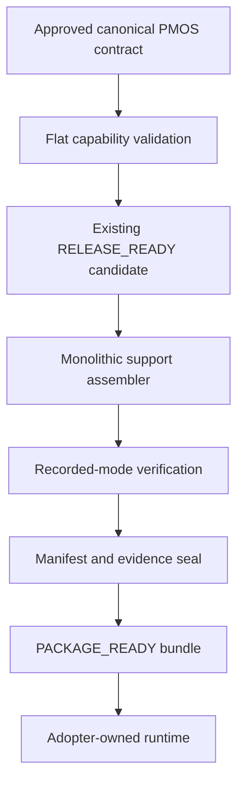

# Customer-support portable package v1

Issue: #176

## Boundary

The build plane accepts only an approved canonical PMOS contract. It preserves the
historical frozen-core meaning of `RELEASE_READY`, assembles the unchanged verified
candidate into a portable bundle, and emits the separate `PACKAGE_READY` result under
evidence schema `2.0.0-package`.

Engineering OS does not provision or operate compute, storage, model credentials,
help-desk accounts, domains, or monitoring. Adopters supply those resources. The v1
reference bundle runs without a paid account through recorded model responses,
in-memory ticket storage, and a fixture connector.

## Architecture



There is no v1 capability graph, package registry, observability interface, signing
service, direct PRD compiler, deployment provider, or live-model certification.

## Contract invariants

- Product type/version and all fields are exact; unknown fields fail closed.
- Required and forbidden capabilities use flat exact sets against a static allowlist.
- Every forbidden capability has a named negative proof.
- Missing/contradictory facts, forbidden actions, and policy-bound violations are
  mandatory deterministic escalation triggers. Confidence is additive only.
- Runtime modes are exactly `recorded`, `memory`, and `fixture` for v1.
- Secret values are forbidden.

## Package contents and ports

The bundle contains a standard-library HTTP service, recorded corpus, in-memory
repository behavior, fixture connector behavior, strict configuration schema,
Dockerfile, Compose example, lockfile, SBOM, negative tests, contract, manifest, and
documentation.

`ModelGateway` is a platform boundary. `TicketRepository` and `TicketConnector` are
customer-support product boundaries. V1 writes redacted structured logs to stdout and
does not invent an observability abstraction.

## Evidence and claims

The manifest binds the contract, every file, source, lockfile, SBOM, required/forbidden
capabilities, forbidden proofs, state vocabulary, per-port modes, and recorded-corpus
digest. Verification rejects missing, changed, or extra files.

Recorded mode proves deterministic policy outcomes, fixed-corpus behavior, bounded
input/output, deterministic escalation, forbidden side-effect absence, adapter modes,
secret absence, corpus integrity, and clean local operation. It does not prove live
model quality, prompt-injection resistance, hallucination rate, vendor connectors,
container reproducibility, or production deployment.

## Commands

```bash
pmpe barebones package build \
  --contract examples/support-package/contract.json \
  --output /tmp/customer-support-package

pmpe barebones package verify --bundle /tmp/customer-support-package

python /tmp/customer-support-package/app.py --port 8080
```

The exact end-state claim is:

> Engineering OS converts one approved customer-support product contract into an
> independently verifiable `PACKAGE_READY` portable application package with reference
> in-memory storage, recorded model, and fixture connector adapters. Adopters supply and
> operate their own infrastructure. Live-model behavior, vendor connectors, and
> production deployment are outside this claim.
